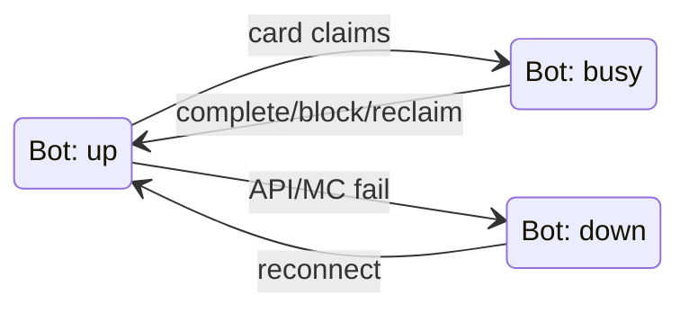

# Board dynamics: operations layer

Status: **design exploration** (2026-06-05). How cards behave at scale: leasing, binding bots to agents, maintenance, preemption, failure recovery.

[`target.md`](target.md) defines the building blocks and card flow. This doc is **runtime behavior** — per-bot mutex, **lexicographic bind** (no weighted scorer at MVP), interrupts, and what `@dispatcher` does between `@planner` and workers.

Companion docs: [`hermes-agents.md`](hermes-agents.md), [`components.md`](components.md), [`workspaces.md`](workspaces.md), [`data-api.md`](data-api.md) (fleet + recall live state), [`hermes-v0.15-reference.md`](hermes-v0.15-reference.md), [`../specs/kanban/plugin-landfolk.md`](../specs/kanban/plugin-landfolk.md).

---

## What `@dispatcher` owns (one picture)

```
@planner intents (assignee=agent, no bot yet)
        → @dispatcher binds (lexicographic rules), writes kanban_create + metadata.bot
        → landfolk gate-check: one in-flight card per metadata.bot
        → worker runs one phase, completes, exits
        → WS events: reclaim, rebind ready cards, issue maintenance / repair / URGENT
```

Everything below expands these four responsibilities: **bind**, **mutex**, **interrupt**, **recover**.

**MVP principle:** the dispatch tick is **deterministic code** (Python or a thin Hermes cron worker). No LLM in bind, maint, or rebind — only `@planner` uses a model for prose triage when the card body is not already DSL.

---

## MVP: minimal states, no weights

Fine-tuning can come later. The elegant default is **few states** and **one ordered rule list** — not a weighted score and not a large transition graph.

### States that matter to `@dispatcher`

Hermes already owns card status (`ready`, `running`, `blocked`, …). For dispatch decisions, collapse to what you act on:

| View | Values | Meaning |
|---|---|---|
| **Bot (derived each tick)** | `up` · `down` · `busy` | `up` = HTTP OK + MC connected; `busy` = has running card on this bot; `down` = otherwise |
| **Card (for binding)** | `needs_bot` · `bound` · `terminal` | `needs_bot` = ready, no `metadata.bot`; `bound` = ready with bot; `terminal` = done/archived (ignore) |

You do **not** model separate “stale lease”, “parked mutex”, “preempted” states in the dispatcher — those are kanban/plugin details. Dispatcher reacts to **WS events** and **blocked reasons**, not every Hermes internal.



### One tick, fixed priority (lexicographic bind)

Each `@dispatcher` cycle (~60s), run **in this order**. First match wins; no sums, no coefficients.

1. **Safety** — For each `busy` bot: if running card is URGENT-class (`[URGENT]` or priority ≥ 90), ensure nothing else is queued ahead on that bot (mutex already handles one runner).
2. **Interrupt** — If a new URGENT card exists for bot B and B is `busy` on non-URGENT work → preempt (SIGTERM + checkpoint); skip bind math.
3. **Down bot** — For each `bound` card whose `metadata.bot` is `down` → **rebind** to first `up` bot that passes capability check, or leave parked + operator comment.
4. **Maintenance** — For each `up` and not `busy` bot: if any **threshold** fires (food < 20, HP < 8, tool broken), **insert one** `[MAINT]` card for that bot (dedupe: don’t stack two food cards). Thresholds are booleans, not scores.
5. **Bind intents** — For each `@planner` intent / `needs_bot` ready card:
   - If DSL or intent already names a bot (`@miner pip …` — [`hermes-agents.md`](hermes-agents.md)): **BIND** that bot when `up` and not `busy`; else defer with comment (do not silently reassign).
   - Else choose bot = **first** `up`, not `busy` bot in this ordered list:
     - same bot that **just completed** a card with the same target `:mark:` (continuity)
     - else same bot that **last touched** that mark (from completion metadata)
     - else **nearest** `up` bot to target (`:mark:` coords or `GET …/recall/near?subject=&type=` — [`data-api.md`](data-api.md))
     - else any `up` bot that passes **capability** (registry flag or inventory snapshot — not LLM)
     - else **defer** (comment back-pressure; do not create a card with a bad bind)
   - **Recall inject (shift-left):** before `kanban_create` or on PATCH of body, if title/body matches keyword table → `recall.near` → append up to **3 plain-language bullets** to card body (worker reads prose, not JSON). Same table as [`data-api.md`](data-api.md) `recall/match`.
6. **Blocked hygiene** — On `blocked` + reason prefix `world_state_mismatch:` → insert **one** repair card; on repair **done** → `kanban_unblock` linked ids. On `dead_mid_card:` → insert short recovery chain (equip → return → resume) **or** rebind to another `up` bot if dead bot is `down` and another `up` bot is nearer target (hand off = rebind, not a special state).

That’s the whole scheduler for MVP. **Priority numbers on cards** (70 vs 85) only sort **ready queue** within the same bot lane; they don’t feed a formula.

### Three dispatcher **actions** (all transitions)

Every side effect is one of:

| Action | Effect |
|---|---|
| **BIND** | Set `metadata.bot` on create or PATCH ready card |
| **INSERT** | `kanban_create` child/maintenance/urgent/repair card |
| **REWRITE** | Rebind bot, preempt (plugin), unblock, reassign |

No fourth “score store”, no forecast object required for bind.

### Card tags the tick parses (closed set)

Dispatcher logic keys off **title prefixes** and **block-reason prefixes**, not free text:

| Signal | Pattern | Dispatcher action |
|---|---|---|
| URGENT | `[URGENT]` or priority ≥ 90 | Interrupt step 2 |
| Maintenance | `[MAINT]` | Insert step 4 (dedupe per bot) |
| Repair | `[REPAIR]` or child of `world_state_mismatch` blocker | INSERT; unblock on complete |
| Work | `[NAV]`, `[MINE]`, `[BUILD]`, … | Bind step 5 only |

`@planner` should emit these tags when materializing DSL lines so bind/maint rules stay regex-stable.

### When to add weights again

Add a weighted score **only** when the lexicographic list produces obvious wrong binds in logs (e.g. two idle bots, continuity ties). Start by adding **one** tie-breaker level (e.g. travel distance), not a full affine formula. Capacity forecast remains **phase 2** (defer until step 9 in pilot).

---

## Leasing and the bot mutex

Hermes v0.15 already provides leases — use them, don't reinvent ([ref](hermes-v0.15-reference.md#kanban--lifecycle-claim_lock-heartbeat)).

| Event | Mechanism |
|---|---|
| Claim | `claim_lock` at dispatch |
| Stay alive | Worker `kanban_heartbeat` every 5–10 min (≤ 1 hr) |
| Normal exit | `kanban_complete` / `kanban_block` releases lock |
| Crash | PID death → reclaim → `ready` |
| Stale | Heartbeat or TTL past `dispatch_stale_timeout_seconds` (default 4 hr) |
| Force move | `hermes kanban reassign` ([June 3 patch](../../reports/expedition/2026-06-03-hermes-framework-patches.patch)) |

**Per-bot exclusion** sits on the landfolk plugin gate-check: scope mutex on **`metadata.bot`**, not assignee (assignee is the agent profile). Park excess ready cards with `mutex_park:<bot>`. **Lease ends when the card ends** — no cross-card bot reservations.

---

## Write-time binding

`assignee` is required at `kanban_create` ([ref](hermes-v0.15-reference.md#kanban--create-flags-and-fields)). **`assignee` = agent profile** (e.g. `miner`). **`metadata.bot` = body** (e.g. `pip`).

Implications for `@dispatcher`:

1. Pick the bot when materializing `@planner` intents into cards — not at dispatch time.
2. Read **fresh** fleet state at bind time (bot HTTP `/health`, `/status`; later host [`data-api.md`](data-api.md) operations slice).
3. On WS `crashed` / `died` / `reclaimed`, rebind **ready** cards whose `metadata.bot` matches before they start.

Stale picks are rare (seconds between bind and dispatch); WS + reassign handles bot death. No Hermes “late binding” — that’s why `@dispatcher` exists.

Binding logic for MVP: see **MVP: minimal states, no weights** above (lexicographic list, not a score). Recall (`GET …/recall/near?subject=…&type=…`) supplies target coords when the card has no `:mark:` yet — [`data-api.md`](data-api.md).

---

## Maintenance lane

Upkeep becomes **explicit cards** from `@dispatcher`, not buried SOUL rules:

| Trigger (example) | Card pattern | Ready-queue priority |
|---|---|---|
| `food < 20` | `@farmer <bot> hunt/cook/tend` | 70 |
| Tool durability low | `@crafter <bot> repair` | 75 |
| Night, underground | `@navigator <bot> sleep` | 80 |
| Low torches mid-mission | `@crafter <bot> restock` | 65 |
| Low HP, not in combat | `@navigator <bot> return to :base:` or `@farmer <bot> eat/heal` | 85 |

**Dispatcher rule:** step 4 of the tick inserts **at most one** maint card per bot when a threshold is true. Table priorities only order ready cards on that bot; they are not weights in a formula.

---

## Preemption (URGENT)

Generalize today’s `[CHAT_REQUEST]` mutex bypass to **`[URGENT]` or priority ≥ 90**:

1. Gate-check sends graceful SIGTERM to running worker.
2. Worker writes a **`[preempted]`** checkpoint comment (same idea as `[run_state]`), exits 0.
3. Lock cleared; URGENT card claims the bot.
4. After URGENT, preempted card returns to `ready`; `@dispatcher` may rebind a different bot.

Threat detection can be `@sentinel` cards or operator-written URGENT first; automate watch loops after the lane works.

---

## Failures: preflight, repair, death

**Local preflight (per agent bundle, turn 1):** read expected world state (blueprint section, mark, recall bullets already in card body) → `mc observe` / inspect → if mismatch, `kanban_block` with a structured reason e.g. `world_state_mismatch:section_3:…` → **do not** proceed on a bad foundation. Nav blockers at site: worker calls `recall.blocked("path")` or preset ([`data-api.md`](data-api.md)) so the next bind can avoid the cell — no narrative-only comments.

**Repair chain:** `@dispatcher` (WS subscriber) sees `blocked` + `world_state_mismatch` → creates a repair card (higher priority) → on repair **complete**, `kanban_unblock` dependents (handle multiple blockers on one repair explicitly).

**Bot death mid-card:**

- **Same bot:** worker blocks with `dead_mid_card`; `@dispatcher` chains re-equip → return → resume; unblock original when resume completes.
- **Hand off:** change `metadata.bot` (or reassign) to an idle capable bot when travel/recovery cost favors swap (deep death, repeated respawn failures, idle candidate at base).

Cards bound but not yet started: only rebind `metadata.bot` — no worker to kill.

---

## Delegation (narrow role)

`delegate_task` is **intra-phase, short, bot-less** work (budget math, file summarization) with per-step `model=`. It is **not** a substitute for kanban phases — no durability across parent restart, max depth 1–3 ([ref](hermes-v0.15-reference.md#delegation)).

**Outer phases stay separate cards** for clean context, board visibility, and handoff metadata.

---

## State `@dispatcher` reads and writes

Details of git layout: [`workspaces.md`](workspaces.md). Operationally:

| Artifact | Writer | Purpose |
|---|---|---|
| Fleet snapshot | `@dispatcher` each tick | Positions, HP, food, idle/busy — pilot: yaml under dispatcher workspace; target: host API `operations/fleet-state` |
| Capacity forecast | `@dispatcher` (later) | Backlog pressure vs horizon — defer until duration baselines exist |
| Kanban DB | Hermes | Cards, locks, deps — source of truth for board |
| Recall stream | Workers (+ optional bot auto-emit) | `subject` + `type` events — [`data-api.md`](data-api.md) |
| Dispatch log | `@dispatcher` (optional MVP) | Append-only bind/rebind/defer decisions → host `operations/dispatch-log` |
| Intent queue | `@planner` | **Target:** ready kanban rows with `assignee` set and **no** `metadata.bot` (`needs_bot`). Optional mirror in `operations/intent-log` for audit — not required if board is source of truth |

One worker per bot ⇒ no contention on bot-scoped execution. Dispatcher artifacts are **single-writer**.

---

## Shift-left: keep dispatch off the LLM

| Step | Automate with | Agent LLM role |
|---|---|---|
| Parse `@` lines | Deterministic parser ([`hermes-agents.md`](hermes-agents.md)) | None for DSL bodies |
| Pick bot | Lexicographic tick + registry capability | None at MVP |
| Target coords | `:mark:` lookup, `recall.near`, inject bullets | Worker reads injected bullets |
| Maint thresholds | Poll `GET /status` (food, HP, tool) | None |
| URGENT | Title tag + WS | Operator or future `@sentinel` script |
| Repair/unblock | Block-reason prefix → fixed card template | Repair worker only |

**Script-first MVP:** implement the tick as `scripts/dispatcher-tick.py` (or landfolk plugin cron) before a `@dispatcher` Hermes profile. Dogfood the agent profile only when you need comments/explanations for operators.

---

## Capacity and dashboard (deferred detail)

**Capacity forecasting** — project committed hours per bot/epic, expose `backlog_pressure` so `@planner` defers non-urgent epics when fleet is saturated. Ship **after** pilot steps 1–4 collect real card durations; first forecasts will be wrong.

**Board views at 50+ cards** — invest in dashboard lenses, not new backend primitives: bot swimlanes (mutex + active workers), epic collapse (`task_links`), dependency DAG per epic, event pulse (WS `/events?since=`). Block reasons in UI (`world_state_mismatch:…`) matter more than another status column.

---

## Hermes vs our code

| Concern | Hermes | We build |
|---|---|---|
| Claim / heartbeat / reclaim | ✓ | — |
| Per-**bot** mutex | board-wide `max_in_progress` only | landfolk gate-check on `metadata.bot` |
| WS events, workers API | ✓ | `@dispatcher` subscriber |
| Bind agent + bot at create | assignee required | `@dispatcher` lexicographic bind (MVP section) |
| Maintenance / URGENT / repair | — | `@dispatcher` rules + conventions |
| Preflight | — | agent skill sections |
| Fleet + forecast | — | poll bot HTTP → file or host API |

No Hermes core patches required for MVP.

---

## Pilot path (stop anywhere)

1. **Lease observability** — dashboard: active workers + parked mutex cards.
2. **Fleet snapshot** — tick writes fleet state (read-only bind); later `PUT …/operations/fleet-state`.
3. **Advisory bind** — comment which bot the lexicographic list would pick; operator sanity-check before auto-bind.
4. **Recall inject** — keyword table + 3 bullets on create for one agent (e.g. `@miner` + “iron”).
5. **One agent E2E** — e.g. `@navigator`: auto-bind + complete one card.
6. **WS rebind** — bot dies between bind and dispatch; card gets new `metadata.bot`.
7. **One maintenance rule** — e.g. low food → `@farmer` card.
8. **One preflight + repair** — e.g. `@builder` mismatch → repair chain.
9. **URGENT lane** — manual URGENT first; watcher automation later.
10. **Capacity forecast** — only with enough duration history.

---

## Open questions

1. **`@dispatcher` as Hermes agent vs gate-check extension** — lean: agent (dogfood the model).
2. **Stale fleet reads** — timeout + `stale_since` on snapshot when bot HTTP is down.
3. **`[preempted]` schema** — align with `[run_state]` before workers implement handlers.
4. **Repair → unblock** — one repair unblocking many dependents; idempotent unblock.
5. **WS cursor** — persist `last_seen_event_id` across dispatcher restarts.

---

## Related

- [`target.md`](target.md) — planner → dispatcher → workers flow
- [`data-api.md`](data-api.md) — recall + operations persistence
