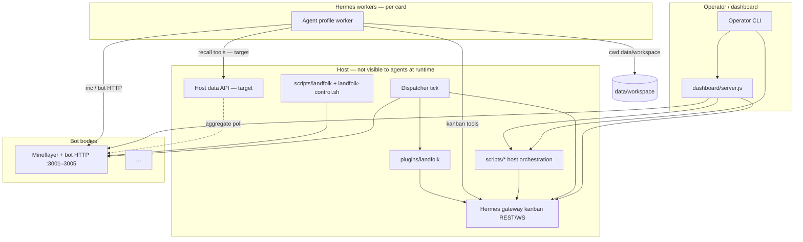

# Runtime components

Status: **design exploration** (2026-06-05). Maps **what runs on the host**, **what agents invoke**, and **which APIs connect them**. Target-state labels match [`target.md`](target.md); today’s paths are what the repo actually runs.

This doc is the **inventory**. Behavior details live elsewhere:

| Question | Doc |
|---|---|
| Vocabulary, card flow, concerns | [`target.md`](target.md) |
| Reflex-first `mc` interface | [`embodied-control.md`](embodied-control.md) |
| Hermes profiles, skills, DSL | [`hermes-agents.md`](hermes-agents.md) |
| Bot registry, `mc`, HTTP, marks | [`bots-and-mc.md`](bots-and-mc.md) |
| Dispatcher tick, bind, maintenance | [`board-dynamics.md`](board-dynamics.md) |
| Host recall + operations HTTP contract | [`data-api.md`](data-api.md) |
| Git workspace, OWNERS, agent cwd | [`workspaces.md`](workspaces.md) |
| Keep / replace during migration | [`impact.md`](impact.md) |
| Colony UI metrics + trends | [`dashboard-metrics-spec.md`](dashboard-metrics-spec.md) |
| Operator CLI surface (kanban, mc, genesis) | [`../../AGENTS.md`](../../AGENTS.md) |

---

## Topology (today → target)

**Isolation:** agent workers must not depend on `bot/`, `plugins/`, `scripts/`, or `dashboard/` at runtime ([`workspaces.md`](workspaces.md)). The dashboard and host scripts are **read-mostly consumers** of bot + kanban state; agents use **mc**, **Hermes tools**, and **workspace scripts** under OWNERS.

---

## Component kinds

| Kind | Runs as | Typical trigger | Who uses it |
|---|---|---|---|
| **Long-lived process** | systemd / landfolk supervisor | Boot, `scripts/landfolk start` | Host |
| **Periodic tick** | shell loop, cron, or poller | Fixed interval (5–60s) | Host (deterministic; no LLM at MVP for dispatch) |
| **Event-driven hook** | Hermes / landfolk plugin | Worker tool call, kanban WS | Host + workers |
| **On-demand host script** | CLI | Operator, genesis, CI | Operator / maintainer |
| **Ephemeral worker** | Hermes spawn | Card claimed | Agent profile |
| **Read-only consumer** | HTTP poll | Browser / dashboard | Operator |

---

## Long-lived processes

| Component | Today | Target | Notes |
|---|---|---|---|
| Minecraft server | `server/` | Same | World sim; RCON optional for ops |
| Mineflayer bot process | `bot/` via `scripts/landfolk` | Same; registry `data/bots/*.yaml` | One HTTP API port per bot |
| Bot HTTP API | `bot/lib/server/*` | Same | [`docs/reference/mc-cheatsheet.md`](../reference/mc-cheatsheet.md) from registry |
| Hermes gateway | External install | Same | Kanban DB, worker spawn, REST + WS |
| Dashboard | `dashboard/server.js` | + colony rollup / trends writer | Proxies fleet, kanban, map; see below |
| Host data API | *(not shipped)* | `plugins/landfolk` data_api module | [`data-api.md`](data-api.md) |

### Supervision contract (PIDs and restarts)

Host orchestration only — **not** visible to agent workers. Card→body binding rules: [`bots-and-mc.md`](bots-and-mc.md) § Fleet binding.

| Process kind | Typical management | PID / state | Notes |
|---|---|---|---|
| **Mineflayer body** | [`scripts/landfolk`](../../scripts/landfolk), [`scripts/colony`](../../scripts/colony) `start <id>` | Supervisor or parent shell; optional pidfiles | One Node process per registry id; port from `data/bots/<id>.yaml` |
| **Bot HTTP** | Same process as Mineflayer | N/A (in-process listener) | **Liveness** for dispatch = `GET /health` or `/status`, not OS PID |
| **Hermes gateway** | Operator / systemd | Gateway PID | Kanban DB, worker spawn, WS |
| **Hermes worker** | Gateway spawn | Ephemeral child PID | **Not** the bot body — one worker per claimed card |
| **Dispatcher loop** | [`landfolk-dispatcher.sh`](../../scripts/landfolk-dispatcher.sh), trial scripts | Often `/tmp/*-dispatcher-*-pid` | Kill pidfile on teardown; see capstone runbooks |
| **Bot watchdog** | [`landfolk-control.sh`](../../scripts/landfolk-control.sh) ~8s | Internal | Restart stuck connect/collect; **restart ≠ rebind** — WS/dispatcher rebinds cards on body death |

**Conventions (operator):**

- Trial scripts may write pidfiles under `/tmp` (e.g. `wheat-dispatcher-w1-pid`). Reset scripts should kill those PIDs before archiving cards ([`reset-wheat-capstone.sh`](../../scripts/reset-wheat-capstone.sh)).
- Do not use “PID file exists” as proof the bot HTTP API is healthy — always curl `/status` or use [`scripts/roster.py`](../../scripts/roster.py) / dashboard fleet poll.
- Capstone **Tester** is a second long-lived body (separate port); supervision matches any other registry entry.

Target: supervisor state (landfolk) feeds optional `supervisor.pid` into [`data-api.md`](data-api.md) fleet-state records; HTTP remains authoritative for `mc`.

---

## Periodic ticks and watchers

These are **host-side**. At MVP, **dispatch bind/maint/rebind stays script-first** ([`board-dynamics.md`](board-dynamics.md)); LLM use is for `@planner` (and execution workers), not the tick.

| Name | Interval (typical) | Entry point | Role | Target owner |
|---|---|---|---|---|
| **Dispatcher loop** | ~60s | [`scripts/landfolk-dispatcher.sh`](../../scripts/landfolk-dispatcher.sh) | `hermes landfolk gate-check` then kanban dispatch when gateway mode off | `scripts/dispatcher-tick.py` or plugin cron; same steps |
| **Gate-check** | Each dispatcher tick | `hermes landfolk gate-check` | Per-assignee mutex; promote one ready card | Extend for `metadata.bot` mutex |
| **Bot watchdog** | ~8s | [`scripts/landfolk-control.sh`](../../scripts/landfolk-control.sh) | Stuck connect/collect, restart bot | Unchanged |
| **Genesis phase poller** | configurable | [`scripts/genesis-phase-poller.py`](../../scripts/genesis-phase-poller.py) | Establish run progression | Same during genesis |
| **Chat wake / steward listener** | ~5s | [`scripts/landfolk-chat-wake.py`](../../scripts/landfolk-chat-wake.py), [`steward-chat-listener.py`](../../scripts/steward-chat-listener.py) | In-game chat → kanban | `@sentinel` / chat adapter |
| **Steward supervisor** | poll | [`scripts/steward-supervisor.py`](../../scripts/steward-supervisor.py) | Blocked-card steward workers | WS handler in `@dispatcher` |
| **Auto stuck check** | batch | [`scripts/auto-stuck-check.py`](../../scripts/auto-stuck-check.py) | Progress log patterns | Kanban WS events |
| **Inactive card pauser** | batch | [`scripts/inactive-cards-pauser.py`](../../scripts/inactive-cards-pauser.py) | Stale ready cards | Dispatcher maint step |
| **Marks reconcile** | loop / job | [`scripts/reconcile-marks.py`](../../scripts/reconcile-marks.py) | `locations-base.json` | Compaction / maint card |
| **Dashboard fleet build** | per `/api/fleet` request + background tick | [`dashboard/server.js`](../../dashboard/server.js) | Poll bots, merge kanban, OpenRouter | + hourly `trends/hourly.jsonl` |
| **Log aggregate** | poll | [`scripts/landfolk-logs-aggregate.py`](../../scripts/landfolk-logs-aggregate.py) | Cognition / log pipelines | Optional; not agent-facing |

**Scheduled cards (target):** `[COMPACT]`, `[MAINT]`, `@sentinel` watches, and epic judgment run as **kanban cards** with assignee agents or scripts — not a separate scheduler service. Compaction cadence is board-driven ([`workspaces.md`](workspaces.md)).

---

## Host scripts (operator and CI)

Grouped by job; full tree is `scripts/`. Canonical operator surface is [`AGENTS.md`](../../AGENTS.md).

| Group | Examples | Agent-visible? |
|---|---|---|
| **Kanban facade** | [`scripts/kanban`](../../scripts/kanban) | No — operator; `@planner`/`@dispatcher` use Hermes kanban APIs |
| **Fleet / roster** | [`roster.py`](../../scripts/roster.py), [`fleet-status.py`](../../scripts/fleet-status.py) | No |
| **Landfolk lifecycle** | [`landfolk`](../../scripts/landfolk), [`landfolk-control.sh`](../../scripts/landfolk-control.sh), [`genesis.sh`](../../scripts/genesis.sh) | No |
| **Establish / seed** | `establish-*`, [`establish-seed-cards.py`](../../scripts/establish-seed-cards.py) | No |
| **Deploy / profiles** | [`setup-landfolk-profiles.sh`](../../scripts/setup-landfolk-profiles.sh), [`regenerate-artifacts.sh`](../../scripts/regenerate-artifacts.sh) | No |
| **Analysis / postmortem** | `analyze-*`, `board-recent.py`, `board-snapshot.py` | No |
| **Benchmark / context-tests** | `scripts/benchmark/`, `scripts/context-tests/` | No — engineering |

**Userland agent scripts** live under `data/workspace/<domain>/scripts/` (and eventually replace ad-hoc repo-root scripts for team-maintained tooling). Changes go through back-office `[MR]` cards ([`workspaces.md`](workspaces.md)).

---

## Plugins and Hermes integration

| Surface | Location | Today | Target |
|---|---|---|---|
| **Gate-check + mutex** | [`plugins/landfolk/landfolk/orchestrator/`](../../plugins/landfolk/landfolk/orchestrator/) | Per-assignee | Per `metadata.bot` when set |
| **post_tool_call / pre_tool_call** | [`plugins/landfolk/landfolk/orchestrator/hooks.py`](../../plugins/landfolk/landfolk/orchestrator/hooks.py) | Observer hooks | + path allowlist for agents |
| **Host data API** | *(planned)* `landfolk/data_api/` | — | Recall + operations routes |
| **Hermes kanban** | Gateway plugin | REST, WS `task_events`, dispatch | Primary board API for workers |
| **Distributed `bin/`** | Installed to profile PATH | mc wrapper, kanban helpers | Same; sourced from deploy |

Worker spawn paths today: embedded gateway **or** [`landfolk-dispatcher.sh`](../../scripts/landfolk-dispatcher.sh) with explicit `MC_*` env ([`impact.md`](impact.md) § F). Target: bot-bound spawn layer reads `data/bots/*.yaml`.

---

## API and CLI surfaces

### Bot HTTP (execution plane)

- **Base:** `http://127.0.0.1:<api_port>/` per bot ([`data/agent-registry.json`](../../data/agent-registry.json) today).
- **CLI:** `mc <verb>` → bot server ([`bot/cli/registry.mjs`](../../bot/cli/registry.mjs)).
- **Consumers:** agent workers (primary), dashboard poll, future host data API aggregation ([`data-api.md`](data-api.md)).

### Hermes kanban (coordination plane)

- **Base:** `HERMES_KANBAN_BASE` (e.g. `http://127.0.0.1:27124`) — see [`hermes-v0.15-reference.md`](hermes-v0.15-reference.md).
- **Consumers:** Hermes workers (tools), dashboard (`/api/kanban*`), dispatcher, `scripts/kanban` (shell-outs).

### Dashboard HTTP (operator UI)

Read-only aggregation unless noted:

| Route | Purpose |
|---|---|
| `GET /api/fleet` | Bots health, tasks, OpenRouter credits, chat snippets |
| `GET /api/worlds` | Registry worlds + kanban board ids |
| `GET /api/kanban`, `GET /api/kanban/boards` | Board snapshot via Hermes fallback |
| `POST /api/kanban/dispatch` | Trigger dispatch (operator) |
| `GET /api/agent/:name/inventory\|goals\|cognition\|trail` | Per-bot drill-down |
| `GET /api/map/*`, `/api/poi`, `/api/regions`, `/api/personal-pois` | Map + world context |
| Static `/`, `/static/*` | UI |

Target colony views add reads from `operations/generated/colony-overview.json`, trends JSONL, and optional host rollup API ([`dashboard-metrics-spec.md`](dashboard-metrics-spec.md)).

### Host data API (target — persistence plane)

Documented in [`data-api.md`](data-api.md): `POST/GET …/recall/*`, `GET|PUT …/operations/fleet-state`, append logs, metrics rollup. **Not a replacement** for bot marks or regions.

---

## Agent userland (what a worker may call)

| Surface | Mechanism | Scope |
|---|---|---|
| **In-world actions** | `mc` → bot HTTP | Card phase work |
| **Board** | Hermes kanban tools | Claim, comment, complete, block |
| **Recall** | `workspace` tool → host API | Report / near lookup (target) |
| **Skills** | `skill_view`, bundled markdown | `data/workspace/reference/ingest/skills/` after migration |
| **Workspace scripts** | `terminal` in cwd | `data/workspace/<domain>/scripts/` per OWNERS |
| **Memory / SOUL** | Profile home | `~/.hermes/profiles/<agent>/` |

Workers do **not** get the repo root, `scripts/kanban` as a blessed path, or dashboard URLs in prompts — operators use those.

---

## Coordinator agents vs scripts

| Concern | MVP implementation | Long-term home |
|---|---|---|
| Planning / DSL | `@planner` Hermes profile | Same |
| Bind + fleet snapshot | **Script tick first** | `@dispatcher` profile optional |
| Epic judgment | `@overseer` or card-driven | Same |
| Watch / URGENT | Dispatcher maint + cards | `@sentinel` |
| Compaction | `[COMPACT]` cards → git | Same |

This split avoids over-building Hermes profiles before deterministic loops are trusted ([`board-dynamics.md`](board-dynamics.md)).

---

## Where to document new pieces

When adding a component, update **this file** (one row in the right table) and the **specialized doc** if behavior or schema changes:

- New **HTTP route** on host API → [`data-api.md`](data-api.md)
- New **generated artifact** → [`workspaces.md`](workspaces.md) tree + OWNERS
- New **dispatch rule** → [`board-dynamics.md`](board-dynamics.md)
- New **dashboard metric** → [`dashboard-metrics-spec.md`](dashboard-metrics-spec.md)
- Retiring today’s script → [`impact.md`](impact.md) cross-cutting table
- Supervision / PID convention change → this file § Supervision contract
- Card→body binding rule change → [`bots-and-mc.md`](bots-and-mc.md) § Fleet binding (not here)

Avoid duplicating full script lists in [`impact.md`](impact.md); use impact for **migration posture** and link here for the live map.
