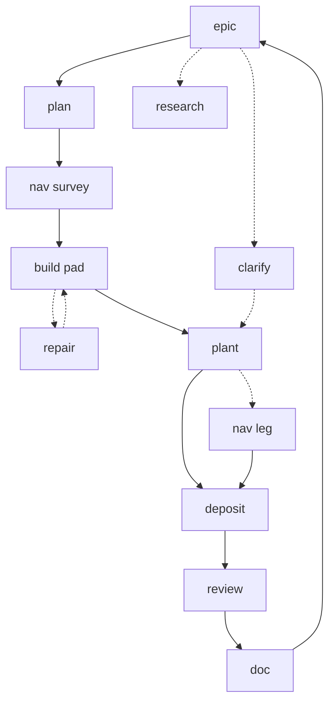

# Walkthrough: wheat farm epic (board view)

Status: **design exploration** (2026-06-05). End-to-end **example** of the target model: one bot (**Mox**), many **agent** assignees, spec-first plan, optional auto-nav legs, review + doc gate. Rules and contracts live in [`epic-lifecycle.md`](epic-lifecycle.md). **Interactive step-through:** [architecture-visual-guide.html §10](architecture-visual-guide.html#wheat-walkthrough).

**Not implemented** as an automated flow yet — use this doc to reason about board events, handoffs, and overhead before building hooks.

---

## Scenario

| Item | Value |
|---|---|
| Epic | `[FARM] Wheat at :field_south:` (`t_e001`) |
| Body bot | **`metadata.bot = mox`** (set once on epic) |
| Places | `farm → field_south`, `deposit → chest_food`, `home → base_anchor` |
| Playbook | `production/ingest/playbooks/wheat-rotation.md` |
| Progress | `scripts/kanban epic t_e001` → **execute** children **done / total** |
| Writes | [`scripts/kanban`](../../scripts/kanban) (`--epic`, `--depends-on`); in-world via **`mc`** on bot-bound workers only |

**Spec on epic (no per-line `@agent`):**

```text
- Survey 16×16 at places.farm
- Level pad at places.farm
- Till and plant wheat 9×9 at places.farm
- Deposit surplus seed at places.deposit
```

---

## Card graph

Solid = **`depends-on`**. Dotted = optional or epic-only (no gate). Handoff JSON on **complete** is described under [Handoff chain](#handoff-chain) — not extra edges. Execute cards share **`metadata.bot=mox`** (one at a time).



---

## Board timeline

**Event** column: action and **assignee** (who Hermes loads on **CLAIM**, or who is set on **CREATE**). **Detail**: kanban/scripts vs **`mc`**, and other artifacts.

### Open and plan

| # | Event | Card | Detail |
|---|--------|------|--------|
| 1 | **CREATE** · assignee **`overseer`** (or operator) | `t_e001` | `scripts/kanban create "…" --assignee overseer` + metadata: `bot=mox`, `places`, `acceptance`, `playbook`, `card_kind=epic`. No `mc`. |
| 2 | **CREATE** · assignee **`planner`** | `t_p001` | `[PLAN] Decompose`, `--epic t_e001`, `card_kind=plan`. |
| 3 | **CREATE** · assignee **`farmer`** (opt.) | `t_r001` | `[RESEARCH] Align playbook`, `--epic t_e001`, desk mode. |
| 4 | **CLAIM → COMPLETE** · **`planner`** | `t_p001` | Profile **planner**. `kanban_create` / facade: `t_x001`–`t_x004` with `assignee` routed from spec, **`metadata.bot=mox`**, `work_at` marks, `--depends-on` chain, `--epic t_e001`. Read playbook file. No `mc`. |
| 5 | **CLAIM → COMPLETE** · **`farmer`** | `t_r001` | Desk **farmer**. Edit/read playbook; `scripts/kanban comment t_e001`. No `mc`. |

### Execute (Mox lane — assignee rotates)

| # | Event | Card | Detail |
|---|--------|------|--------|
| 6 | **CLAIM → COMPLETE** · **`navigator`** | `t_x001` | Spawn **navigator** + Mox `MC_*`. **`mc`** goto/scene/observe @ `:field_south:`. Handoff → builder (below). |
| 7 | **CLAIM → COMPLETE** · **`builder`** | `t_x002` | **`mc`** clear/level. Handoff → farmer. |
| 8 | **BLOCK → REPAIR → UNBLOCK → COMPLETE** · **`builder`** | `t_x002`, `t_rep01` | `kanban_block` `world_state_mismatch:…`. **Dispatcher:** `scripts/kanban create` repair **`builder`**. **`mc`** on repair. `unblock t_x002`. |
| 9 | **CLAIM → COMPLETE** · **`farmer`** | `t_x003` | **`mc`** till/plant @ farm mark. Handoff `exit_pos` @ field. |
| 10 | **INSERT → CLAIM → COMPLETE** · **`navigator`** | `t_n001` | **Leg hook** (design): field far from `:chest_food:` → `scripts/kanban create "[NAV]…" --assignee navigator`, rewire **`crafter`** dep. **`mc goto`** to deposit mark. |
| 11 | **CLAIM → COMPLETE** · **`crafter`** | `t_x004` | **`mc`** deposit / chest @ `:chest_food:`. |

Execute progress: **4/4** core phases **done** (+ repair + optional `t_n001` count as epic members, not always in 4/4 headline).

### Clarify, review, close

| # | Event | Card | Detail |
|---|--------|------|--------|
| 12 | **COMMENT** · (none) | `t_e001` | Operator `scripts/kanban comment` (“7×7 not 9×9”). `@planner` in text does not wake Hermes. |
| 13 | **CREATE → CLAIM → COMPLETE** · **`planner`** | `t_c001` | `[CLARIFY]`. Patch todo/ready bodies; archive stale `auto_leg` nav if any. No `mc`. |
| 14 | **CREATE → CLAIM → COMPLETE** · **`overseer`** | `t_v001` | `[REVIEW]`. `scripts/kanban epic t_e001`, acceptance, child results. No `mc`. |
| 15 | **CREATE → CLAIM → COMPLETE** · **`navigator`** (opt.) | `t_v002` | Verify observe @ farm · **`mc`** if spawned. |
| 16 | **CREATE → CLAIM → COMPLETE** · **`farmer`** | `t_d001` | `[DOC] Update playbook` — required before epic close. Workspace file write. |
| 17 | **COMPLETE** · **`overseer`** | `t_e001` | `scripts/kanban complete t_e001`. Judgment → operations log. |

### After epic

| # | Event | Assignee | Detail |
|---|--------|----------|--------|
| 18 | **CREATE** | **`farmer`** + mox | `[FARM] Tend` from preset, `scheduled_at` — separate from establish epic. |
| 19 | **CREATE** (if needed) | **`engineer`** | Back-office `[BUG]` — no `mc`. |

**Mox execute assignee sequence (typical):**  
`navigator` → `builder` → (`builder` repair) → `farmer` → (`navigator` leg) → `crafter`.

**Desk sequence:** `planner` → (`farmer` research) → `planner` clarify → `overseer` → (`farmer` doc) → `overseer` epic close.

---

## Handoff chain

Handoff lives in **`kanban_complete` result / metadata** (and comments). The **next** worker reads it in turn-1 preflight; chat history is **not** carried across spawns ([`impact.md`](impact.md)).

### Between phases (illustrative JSON)

**After `t_x001` · navigator → builder**

```json
{
  "exit_pos": { "x": 120, "y": 64, "z": -40 },
  "work_at_mark": "field_south",
  "pad_hint": { "corner": { "x": 118, "y": 64, "z": -42 }, "size": 16 },
  "notes": "slight slope NE"
}
```

**After `t_x002` · builder → farmer**

```json
{
  "exit_pos": { "x": 119, "y": 64, "z": -41 },
  "work_at_mark": "field_south",
  "pad_verified": true,
  "surface_block": "dirt"
}
```

**After `t_x003` · farmer → (leg hook) → crafter**

```json
{
  "exit_pos": { "x": 121, "y": 64, "z": -39 },
  "work_at_mark": "field_south",
  "crop": "wheat",
  "planted_area": "9x9",
  "inv_summary": { "wheat_seeds": 2, "wheat": 18 }
}
```

**After `t_n001` · navigator → crafter** (only if leg inserted)

```json
{
  "exit_pos": { "x": -10, "y": 74, "z": 200 },
  "work_at_mark": "chest_food",
  "arrival": "goto_ok"
}
```

**Crafter preflight:** resolve `:chest_food:`; if `distance(exit_pos, chest) > reach` without a leg, **`kanban_block`** `needs_nav:chest_food` ([`epic-lifecycle.md`](epic-lifecycle.md)).

### What handoff is not

- Not a shared Hermes session (fresh worker every card).
- Not full chat transcript (too large; wrong agent).
- Not a substitute for **marks** (committed coords) or **playbook** (grid size).

---

## Latency and system overhead

Order-of-magnitude **design estimates** for planning capacity — measure in pilot (`agent-navigator` POC) and revise. Wall-clock dominates inside long **`mc`** phases; below focuses on **per-card tax**.

### Fixed cost per card (every CLAIM)

| Stage | What happens | Typical range (estimate) | Notes |
|---|---|---|---|
| Dispatch claim | Hermes SQLite claim + landfolk gate-check (`metadata.bot` mutex) | 0.2–2 s | One running card per bot |
| Worker spawn | New process / session, load profile, **`env_passthrough` MC_*** | 2–15 s | Largest variable; local LLM cold start worse |
| Skill load | L0 + `skill_view(agent-*)` + L3 companions on `skills=[…]` | 1–3 LLM turns or 5–30 s wall | Narrow bundle vs today’s wide worker |
| Turn-1 preflight | Read handoff, mark lookup, optional playbook slice | 1 LLM turn + HTTP | **`GET /marks`**, locations-base |
| Complete + hook | `kanban_complete`, `post_tool_call` promote, **leg-insert** script | 0.5–3 s | +1 kanban create if nav leg |
| Desk cards | No spawn inject, no `mc` | 2–10 s + LLM | planner/overseer/farmer doc |

**Rule of thumb:** **~10–30 s fixed overhead per bot-bound card** before meaningful **`mc`** work; **5–15+ LLM turns/card** if the model loops — bundles aim to cut turns, not eliminate spawn.

### This epic (happy path, rough)

| Segment | Cards | Spawn overhead (order of magnitude) | In-world work |
|---|---|---|---|
| Plan + research | 2 desk | ~1–3 min LLM + kanban | — |
| Execute core | 4 (+1 repair +1 leg optional) | **6–8 spawns** → ~1–4 min overhead total | minutes–tens of minutes (build/farm) |
| Review + doc + clarify | 3–4 desk | ~2–5 min | — |

**Trade accepted:** more cards and spawns vs one long Steward worker — bet is **lower tokens/turns per card** and higher success rate ([`target.md`](target.md) success metrics).

### Serial bottleneck

Mox lane is **strictly serial** (mutex). Auto-nav **adds one card** (one spawn) instead of bloating farmer/crafter context with nav skills. Planner does not pay that cost up front; hook pays it only when `distance > R_near`.

### Dispatcher / fleet (background)

| Tick | Period | Work |
|---|---|---|
| `@dispatcher` | ~60 s | `scripts/roster.py`, `/health`, maint insert, rebind, optional leg on complete | Sub-second Python + HTTP unless rebinding many cards |

Does not block **`mc`** except when maint or URGENT preempts Mox.

### What to measure in pilot

1. **Spawn-to-first-`mc`** latency per assignee profile.  
2. **Turn count** and **context tokens** at `kanban_complete` vs baseline wide worker on equivalent work.  
3. **Leg hook:** add time from farmer complete → crafter claim when nav inserted.  
4. **Handoff:** failures from missing `exit_pos` vs mark-only preflight.

---

## Artifacts in this walkthrough

| Artifact | When it appears | Read / write |
|---|---|---|
| **kanban.db** | Every event | All agents; `scripts/kanban epic` |
| **Epic metadata** (`bot`, `places`, `acceptance`, `playbook`) | #1 | Overseer create; planner/dispatcher read |
| **`epic: t_e001` trailer** | #4+ children | Membership, progress scan |
| **`task_links`** | #4 chain, #10 rewire | Order survey→…→deposit; leg insert |
| **`metadata.bot=mox`** | Execute + nav leg | Spawn inject, mutex |
| **`metadata.work_at` / `auto_leg`** | Children, #10 | Leg hook, replan cleanup |
| **Handoff JSON** | #6–11 complete | Next agent preflight |
| **Playbook md** | #5, #9, #16 | Farmer/planner read; doc card write |
| **`data/bots/mox.yaml`** | Each Mox spawn | Port, username |
| **Agent profiles + skills** | Each CLAIM | Hermes load list per assignee |
| **Recall stream** | #6–9 (optional) | `recall.resource` during `mc` |
| **locations-base / marks** | Nav, leg distance | Resolver for `:field_south:`, `:chest_food:` |
| **epic-judgments log** | #17 | Overseer on close |
| **Maint preset** | #18 | Post-epic recurring |

---

## Related

- [`epic-lifecycle.md`](epic-lifecycle.md) — contracts, card modes, auto-nav algorithm  
- [`board-dynamics.md`](board-dynamics.md) — bind, mutex, repair, maint  
- [`hermes-agents.md`](hermes-agents.md) — spec-first plan, assignee routing  
- [`bots-and-mc.md`](bots-and-mc.md) — bot registry, `mc` on the walkthrough cards  
- [`data-api.md`](data-api.md) — recall on execute phases  
