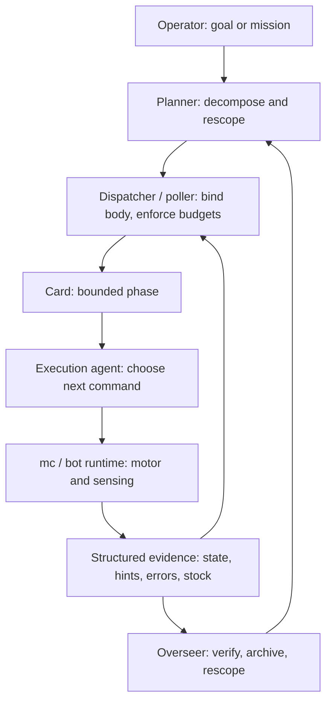

# Target architecture

Status: **active target** (updated 2026-06-20 after genesis-v2 emergent runs). This is the canonical statement of the architecture we are building toward: a sharper agent/framework interface that makes Minecraft agents more efficient in-game by reducing decision entropy, making `mc` commands more robust, and giving agents the observation chain they need for good choices.

Related docs:

- [`embodied-control.md`](embodied-control.md) — reflex-first bot ↔ agent interface and generated `mc` surface.
- [`hermes-agents.md`](hermes-agents.md) — Hermes profiles, skills, and card roles.
- [`bots-and-mc.md`](bots-and-mc.md) — in-game control, bot registry, fleet binding.
- [`board-dynamics.md`](board-dynamics.md) — dispatcher, mutex, recovery, board operations.
- [`stock-truth-model.md`](stock-truth-model.md) — stored/reachable/withdrawable stock contract.
- [`workspaces.md`](workspaces.md) — workspace and runtime access model.
- [`components.md`](components.md), [`impact.md`](impact.md) — process/API map and implementation impact.

---

## Current thesis

The agent framework should make **good in-game decisions cheap**.

Agents should choose among well-shaped options: which goal matters, which card to file, which command line to run next, and when to rescope. The framework should handle the mechanics that language models are bad at doing reliably over long sessions: pathfinding loops, repeated-failure counting, compact observation, stock truth, body binding, verification, and recovery.

The direction is not “use a stronger model” or “write more SOUL prose.” The direction is:

- **Smaller scope per agent invocation.** One card, one phase, one fresh context.
- **Stronger vertical interface.** Bot runtime owns motor control and task-shaped sensing; agents choose goals and commands.
- **Control-plane backstops.** Dispatcher, poller, and overseer enforce budgets, bindings, verification, and rescope paths.
- **Compact truth surfaces.** Observation should answer the current decision, not dump raw state that forces voxel reasoning.

Recent genesis-v2 runs support this direction: the system reached shelter, farm, road, mine, cobble, and wood production. The remaining failures were mostly places where prompt text was asked to enforce an invariant that should live in code.

---

## The problem now

Long Minecraft worker sessions still thrash when the framework exposes too many plausible actions and too little structured truth.

Evidence from recent runs:

- Workers can produce real colony output when profiles are narrow and the planner decomposes work, but tool-error loops still burn hundreds of failed commands when stop conditions are prompt-only.
- `mc` motor programs such as crafting and navigation improve outcomes when they absorb fragile low-level sequences; dense-forest `fell_tree` now needs the same treatment.
- Observation quality directly affects turn count. If `observe` hides marks/signs/torches under nav brief, scouts waste turns rediscovering state.
- Planner quality depends on deterministic summaries: site score, stock sufficiency, blocked dependencies, stale data, and verification results.
- Mark-based progress alone undercounts real work. Run artifacts and verification must be first-class.

So the central architecture question is:

> How do we make the next correct in-game action obvious, bounded, and auditable?

---

## The model in three sentences

**Agents are actor identities. Bots are bodies. Cards pair them for a bounded phase of work.**

An **agent** is a Hermes profile that owns expertise: home directory, model, skills, memory, and SOUL. `@navigator`, `@miner`, `@builder`, `@farmer`, `@planner`, `@dispatcher`, and `@overseer` are agents.

A **bot** is a Minecraft player body: a Mineflayer process with login credentials and an HTTP API. Bots are registry entries, not Hermes profiles. A card binds an agent to a body, injects the body’s `MC_*` environment, runs a phase, records handoff/evidence, then exits.

---

## Vocabulary

| Term | Meaning | Examples |
|---|---|---|
| **Role** | Architectural concern | planning, allocation, execution, review, watch, tooling |
| **Agent** | Hermes profile with expertise | `planner`, `navigator`, `miner`, `builder`, `overseer` |
| **Bot** | Mineflayer-controlled Minecraft body | `pip`, `mox`, `zee`; see [`bots-and-mc.md`](bots-and-mc.md) |
| **Card** | Unit of work on the kanban board | `assignee=<agent>`, `metadata.bot=<bot>`, parents/deps |
| **Control plane** | Host-side scripts/plugins that enforce run invariants | dispatcher, poller, gate-check, backstops |
| **Observation chain** | The sensing path from world state to agent decision | `observe`, `scene`, nav brief, stock brief, planner brief |
| **Human** | Operator | Sets goals, reviews, intervenes on edge cases |

---

## Responsibility split

The architecture works when each layer owns the right kind of decision.

| Layer | Owns | Must not rely on |
|---|---|---|
| **Planner** | Goals, tradeoffs, decomposition, rescope when evidence changes | Raw log reading, stock inference, pathfinder debugging |
| **Dispatcher / poller** | Body binding, mutex, run health, time/error budgets, blocked dependency summaries | LLM self-counting or voluntary stop conditions |
| **Execution agent** | Choosing from the current card’s shaped command surface and leaving handoff evidence | Long multi-phase planning, hidden observe-mode memory, repeated low-level retry loops |
| **Bot runtime / `mc`** | Motor programs, region policy, route hints, partial progress, honest envelopes, task-shaped sensing | Colony strategy, kanban decomposition |
| **Overseer / verifier** | Outcome judgment, impossible/superseded cards, acceptance metadata | Worker narration as proof |
| **Human** | Goals, priorities, exceptional intervention | Routine verification or run-log archaeology |

There is no Steward orchestrator bot in the target. Steward’s concerns split into `@planner`, `@dispatcher`, and `@overseer`. A Steward player, if kept, is just another bot body.

---

## Agent/framework interface contract

The interface is the product. A worker should not need to reverse-engineer the world from prose, logs, or hidden state.

### Cards

Cards should provide:

- a single bounded phase;
- literal `mc` command lines or a narrow playbook phase;
- required mark/site/coord inputs;
- parent/dependency context;
- done criteria and verification hint;
- body binding metadata or a lease ritual;
- max runtime / failure budget where supported.

### Observations

Observation surfaces should provide:

- **task-shaped summaries**: stock, site fit, route options, hazards, blocked dependencies;
- **truth flags**: stale snapshot, brief refresh required, missing POI channel, unknown stock;
- **copy-paste commands** when the next action is mechanical;
- **full override** for scout/planner situations that need marks, signs, torches, or raw details;
- consistent JSON fields so scripts and agents see the same truth.

Observation is not only “what the bot sees.” It is the decision input contract.

### Actions

Every important `mc` action should have:

- a structured success/failure envelope;
- typed `observed_state` or `state_after` where useful;
- `next_action_hint` only when it is safe and fresh;
- partial-progress semantics for long actions;
- bounded retry behavior and explicit retry safety;
- policy-aware hints for regions/protected sites.

### Backstops

The framework, not the prompt, enforces:

- repeated tool-error budgets;
- max runtime / stalled card handling;
- body mutex and lease cleanup;
- no duplicate/superseded card churn;
- audit capture at run end;
- blocked dependency visibility.

---

## Flow

Normal flow:

1. Operator drops a mission, triage card, or `@mention` DSL body.
2. `@planner` emits bounded cards with assignee, deps, required marks/coords, and verification criteria.
3. `@dispatcher` binds a bot body and enforces mutex/runtime constraints.
4. The execution agent runs one phase using a scoped skill/verb surface.
5. Bot runtime returns structured evidence and durable action logs.
6. Worker completes/blocks with handoff metadata.
7. Poller/overseer verifies outcomes, archives superseded work, and asks planner to rescope when needed.

Detailed mechanics live in [`hermes-agents.md`](hermes-agents.md), [`bots-and-mc.md`](bots-and-mc.md), [`board-dynamics.md`](board-dynamics.md), and [`epic-lifecycle.md`](epic-lifecycle.md).

---

## What we lean on Hermes for

| Need | Hermes / kanban primitive |
|---|---|
| Narrow skill catalog per card | `kanban_create(skills=[...])` |
| Sequential / parallel work | card parents / dependencies |
| Runtime budget | `max_runtime_seconds` where available |
| Safe retries | idempotency keys / explicit replacement cards |
| Worker lifecycle | claim, heartbeat, completion/block events |
| Bot-less coordination | planner / dispatcher / overseer profiles |
| Short specialist calls | delegated bot-less research/review where useful |

Hermes provides the card and worker substrate. Minecraft-specific body binding, `mc` env injection, and run-control backstops remain our host layer.

---

## What we build

| Need | Where it lives |
|---|---|
| Agent profiles | `~/.hermes/profiles/<agent>/` plus deployment scripts |
| Bot registry | `data/bots/<bot>.yaml` or equivalent registry source |
| Per-card MC env injection | dispatcher / gate-check wrapper; see [`bots-and-mc.md`](bots-and-mc.md) |
| Per-bot mutex | landfolk plugin / dispatcher on resolved body id |
| Fleet state and bind rules | dispatcher tick and board metadata |
| Agent skill bundles | `skills/agent-*.md` and `minecraft-*` companions; see [`hermes-agents.md`](hermes-agents.md) |
| `mc` agent surface | generated profile-scoped help from registry tiers; see [`embodied-control.md`](embodied-control.md) |
| Observation chain | `observe`, nav brief, stock brief, site brief, planner brief |
| Run control plane | poller backstops, supervise cap behavior, dependency summaries, artifact capture |
| Verification | script predicates first, `@overseer` only when interpretation is needed |
| Live operational memory | handoff comments, recall stream, compact workspace data; see [`data-api.md`](data-api.md) |

### Per-card MC env injection

Bot-bound cards need body-specific `MC_API_URL`, `MC_USERNAME`, and lease context at spawn time. Hermes profiles do not own those values because bots are bodies, not agents.

Resolution: bot-bound spawn goes through our dispatcher/gate-check layer. Bot-less cards use Hermes directly. This stays outside Hermes core.

---

## What we deliberately do not do

- **Do not make SOUL prose the only enforcement layer.** Prompts can describe rules; control plane enforces budgets and stop conditions.
- **Do not collapse planner, dispatcher, and overseer back into a Steward monolith.** The last runs show the split is useful; it needs stronger interfaces.
- **Do not ask agents to debug pathfinder or count repeated failures from memory.** That is runtime/poller work.
- **Do not shrink the `mc` registry by deleting capability.** Keep the large registry; generate a small current surface per profile/playbook.
- **Do not rely on mark count alone for progress.** Verify world outcomes and archive run artifacts.
- **Do not make every worker load every Minecraft skill.** Scope skills by card and profile.
- **Do not patch Hermes core for Minecraft-specific body binding.** Keep this in our dispatcher layer.

---

## Efficiency goals

The architecture is working when a specialist card beats the wide-worker baseline on:

- fewer tool errors per completed card;
- fewer turns to first useful action;
- fewer repeated identical or same-class failures;
- lower context tokens at completion/block;
- faster wall-clock completion for the same world outcome;
- equal or better success rate;
- better auditability: action logs, snapshots, kanban state, and verification explain what happened;
- better observation sufficiency: workers do not need extra turns to discover hidden marks, stock, or route hints.

For genesis-v2 specifically, success means the colony can run longer without operator diagnosis because:

- site selection rejects bad pads before build/farm cards;
- stock state stops oversupply and empty-chest churn;
- dense forest work has bounded partial progress and fallback hints;
- repeated tool-error loops auto-block/rescope before hundreds of failures;
- outcome verification catches impossible/superseded work;
- run artifacts are captured for reproducible postmortems.

Stabilization runbook (retro capture, evidence-gated primitives, verify-smoke buckets): [`genesis-v2-stabilization.md`](genesis-v2-stabilization.md).

---

## Near-term build order

1. **Run control plane:** tool-error backstop, supervise cap outcome, artifact capture.
2. **Observation contract:** `observe --full` / POI override, explicit omissions, stock/site/planner briefs.
3. **Motor robustness:** partial-progress `fell_tree`, dense-forest fallback, corrected route/fix commands.
4. **Planner truth surfaces:** deterministic site scoring, stock sufficiency, blocked dependency summary.
5. **Overseer verification:** script-first acceptance checks, agent judgment only where needed.
6. **Profile-scoped agent surface:** generated `mc help --profile`, narrow skills, context tests that validate affordance use.

These steps refine the interface between agents and framework. They are not separate from in-game performance; they are how we get it.
