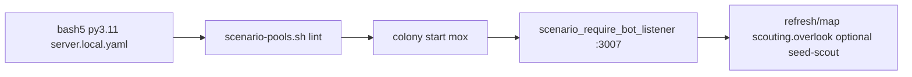

# Proc-nav: seeded catalog, discovery scout, forest clearing, self-improve

## Operational status (trial `proc-nav-1780956289`)

First end-to-end proc-nav trial on **`proc-nav`** + **`proc-nav-lab`** + graph **`proc-scout`**. Reference scorecard: `data/postmortems/proc-nav-lab/proc-nav-1780956289/scorecard.json`.

| Plan tier | Status | Notes |
|-----------|--------|--------|
| **Baseline (Phase B)** | **Soft-pass** | Harness validated (materialize → mvtp → agent-test worker → `mc` + `scout ok`). **Not hard-pass:** catalog anchor quality (**W2-NAV-001** `flat_patch_center` / overlook in air, `mc inspect --mark` INVALID_COORD) and Phase B metrics (**W2-NAV-004** chat-mode tool counter → `mc_cli_invocations` 0 in JSON). Seed not pinned (`TBD_PROC_NAV_BASELINE`). |
| **Core (Phase C)** | **PASS** | **First non-wheat kanban PASS:** `band=pass`, **5/5** cards, `wall_time_s≈1936`, **525** session-parsed `mc` invocations. Verbs exceeded planned Stress *floors* on the Core graph: `go_mark` 44, `scene` 55, `escape` 11, `build_stairs` 7, `dig` 68. `spatial-map.html` written (Core best-effort). Tester `acceptance_*` not run (`per_predicate` empty). |
| **Stress (C-stress + D)** | **Not started** | **`proc-scout-stress`** (3-stop tour, go_mark-only hints) and **`farming.forest_clearing`** agent-test not executed. Core verb counts do **not** replace Stress tier — still need stress graph, optional **proc-nav-stress** seed, and **required** spatial-map gate on Stress runs. |
| **Stretch (Phase E)** | **Loop closed once** | feedback → synthesize → `improvement-queue.json` with **6** issues. **IMPROVE cards** not yet run for deliverables. |

### Issue registry (`data/postmortems/proc-nav-lab/_known_issues.json`)

| ID | Type | Status (post-trial) | Focus |
|----|------|---------------------|--------|
| W2-NAV-001 | AUTO | in_progress | Anchor resolver script; `flat_patch_center` / air overlook; verify via `proc-nav-verify-anchor.sh` |
| W2-NAV-002 | doc | in_progress | Stuck/escape — card bodies + `minecraft-navigation` hints (Core already used escape/stairs heavily) |
| W2-NAV-003 | doc | open | `verify_results` handoff completeness + `test_proc_nav_handoff` |
| W2-NAV-004 | AUTO | **resolved** (`1780961096`) | `agent-test.py` session JSON + `state.db` mc metrics |
| W2-NAV-005 | AUTO | **resolved** (`1780961096`) | Navigator installs **`minecraft-observe`** — no pn-observe block |
| W2-NAV-006 | AUTO | **resolved** (`1780961096`) | Planner cites data sources — ~44% wall / ~41% mc vs first Core |
| W2-NAV-007 | doc | open | Two-bot `proc-scout-road` — 3m corridor overlook→return_post |

**IMPROVE when ready:**

```bash
export RUN_ID=proc-nav-1780956289 BOARD=proc-nav-lab
scripts/seed-w2-improve-cards.sh W2-NAV-001 "$RUN_ID"
# repeat for W2-NAV-004, W2-NAV-005, W2-NAV-006
```

### Wave 2 — agent-led iteration (active)

Agents **fix simple bugs in `scripts/`, `prototypes/agent-arch/`, and specs directly** when tied to `W2-NAV-*`; run **`scripts/proc-nav-trial.sh verify-fast`** before asking for a live trial. Full kanban IMPROVE is **optional** (001 workspace script, large changes).

**Workspaces alignment:** Target model blocks agent writes to `scripts/` ([`docs/architecture/workspaces.md`](../../docs/architecture/workspaces.md) Layer 1). Proc-nav Wave 2 is an **interim proto-rig exception** — harness fixes by coding agents/maintainers; promoted nav tools should land under **`geo/scripts/`** per workspaces § Interim capstone / proc-nav lanes.

| Step | Action |
|------|--------|
| 1 | Repo fix: **004** `agent-test.py`, **005** `setup-role-profiles.sh`, **006** `proc_scout_graph.py` |
| 2 | `verify-fast` (pytest + dry-run + anchor verifier) |
| 3 | **001** mapcatalog/anchor + `proc_nav_anchor_coords.sh` |
| 4 | Short **baseline** re-gate + seed pin |
| 5 | **003/002** docs/skills as needed |
| 6 | Batch **stress** + **forest** (ops); calibrate stress thresholds after |

Kanban IMPROVE when desired: `BOARD=proc-nav-lab scripts/seed-w2-improve-cards.sh W2-NAV-<id> proc-nav-1780956289`

---

## Design intent (unchanged)

Discovery on mapcatalog anchors; W2-slim harness (kanban board **`proc-nav-lab`**, Mox :3007, [wheat-dispatcher.sh](scripts/wheat-dispatcher.sh)); no genesis same session; perception via `mc scene` / `data.nav_header`.

---

## Minecraft world policy

**Do not use** the campaign world (`world` / genesis) or **`landfolk-test`** as the procedural arena. Wheat/colony fixtures live on **landfolk-test**; proc-nav is a separate program.

| Name | What it is |
|------|------------|
| **`proc-nav`** (recommended) | **New dedicated Multiverse world** for this program only. Mapcatalog may `mv delete` / `mv create` here (names must match `proc-*` per [mapcatalog/server_config.py](mapcatalog/server_config.py)). Mox is `mvtp`’d into **`proc-nav`** for agent-test prep and kanban execute. |
| **`landfolk-test`** | **Evac hub only** — spec cleanup and materialize evac send bots here between runs ([server.local.yaml.example](server.local.yaml.example) `hub_world`). |
| **`proc-lab`** | **Off limits for proc-nav** — in active use for seed/catalog testing and establish ([procedural-bench-runbook.md](docs/guides/procedural-bench-runbook.md)). Proc-nav **never** sets `world.name: proc-lab` or materializes into that slot. |

**Operator setup (first time):** In gitignored **`server.local.yaml`**, set `world.name: proc-nav` (not only `proc-lab`). Include **Mox** in `world.evac.bot_players`. First materialize creates the world via mapcatalog `try` (same as today, different slot). Optional one-shot: [reset-proc-lab.py](scripts/reset-proc-lab.py) with `--world proc-nav --seed <N>` for a clean disc.

**Naming clarity:** Kanban board **`proc-nav-lab`** is Hermes SQLite namespace only — it is **not** the Minecraft dimension name.

**Code/docs touch list:** overlook / map-anchor / flat-pad migrated to `{{PROC_WORLD}}` + `{{BOT_USERNAME}}`. [kanban-smoke](data/agent-tests/topics/establishment/kanban-smoke.yaml) still `proc-lab` (establish track only).

### World adoption — two parallel paths (verified)

W2 showed **env/world mismatch** is the top failure mode. Do **not** block Phase B on full template migration.

| Path | When | What |
|------|------|------|
| **Tactical (Phase B)** | First | New **`data/agent-tests/topics/scouting/overlook-survey-proc-nav.yaml`** — copy overlook-survey with **`proc-nav`** hardcoded in `world:`, prep, cleanup, prompt (plus `{{BOT_USERNAME}}` when A2 lands). Point registry `agent_test_ref` at tactical file **or** run `AGENT_SPEC=…/overlook-survey-proc-nav.yaml scenario-agent-test.sh scouting.overlook`. Operator **`server.local.yaml` must use `world.name: proc-nav`**. |
| **Systematic (Core+)** | After Baseline PASS | `{{PROC_WORLD}}` in [agent-test-from-map.py](scripts/agent-test-from-map.py); roll through all proc-lab specs; preflight fails if yaml still says `proc-lab` while running proc-nav trial. |

**Mapcatalog / MV spike (before live Phase B):** Code review confirms [lifecycle.py](mapcatalog/lifecycle.py) uses **`cfg.world_name`** everywhere (`assert_proc_world` only requires `proc-*` prefix — **`proc-nav` qualifies**). `delete_and_create_world` is name-agnostic; [reset-proc-lab.py](scripts/reset-proc-lab.py) accepts `--world proc-nav`. **Not yet exercised** under that exact name in ops — todo **`spike-proc-nav-mv-world`**: one `mapcatalog try` (or `reset-proc-lab.py --world proc-nav --seed N`) with local yaml, confirm `mv load proc-nav` and bot dimension. Unit tests today only assert `proc-lab` strings ([test_reset_proc_lab.py](scripts/tests/test_reset_proc_lab.py)).

---

## Success tiers (baseline → stress)

Gates are **sequential**: each tier unlocks the next. Ambition lives in **Stress** and **Stretch** — not in lowering Baseline.

| Tier | When | Purpose |
|------|------|---------|
| **Baseline** | Phase B PASS on pinned `scouting.overlook` seed | Prove Mox + `proc-nav` + agent-test harness + minimal nav (`move`/`goto`/`scene`) on catalog anchors. |
| **Core** | Phase C PASS with graph `proc-scout` | Kanban dispatcher, marks, planner/observe handoff, `verify_results` contract. |
| **Stress** | Phase C **re-run** with `proc-scout-stress` **or** Phase D forest + steep approach | Force **skill + mc** paths we care about in production: `go_mark`, `escape`, `reachable`, `build_stairs`/`dig`, repeated `scene`, multi-anchor tours. |
| **Stretch** | Phase E promoted artifact + Stress re-run | W2-style improve loop; scorecard beats baseline wall time or verb-efficiency without manual mid-run edits. |

**Rule:** Do not start **Stress** until **Baseline** and **Core** are green on the **same** pinned seed (overlook). Stress may add a **second pinned seed** (`scouting.steep_slope` or `building.gentle_hill` on `proc-nav`) documented in `calibration/seeds.yaml` under keys `proc-nav-baseline` and `proc-nav-stress`.

---

## Skills and `mc` verbs under test

Load-bearing bundles (must appear on graph cards / agent-test `skills:`):

| Bundle | Stress relevance |
|--------|------------------|
| [kanban-worker](skills/kanban-worker.md) | Every execute worker |
| [agent-navigator](skills/agent-navigator.md) | Execute cards |
| [minecraft-navigation](skills/minecraft-navigation.md) | `move`, `go_mark`, `escape`, `reachable`, `build_stairs`, `scene`, `status` |
| [minecraft-observe](skills/minecraft-observe.md) | Observe card only |
| [agent-planner](skills/agent-planner.md) | Desk planner |
| [minecraft-mining](skills/minecraft-mining.md) | Stress lip/`dig` when hints say so (registry already lists for scouting topic) |

**Baseline verb set (Phase B — must appear in run JSON `mc_cli_invocations`):** `status`, `scene`, and at least one of `move` | `goto` | `go_mark`.

**Core verb set (Phase C — scorecard + optional agent-test post-check on session export):** Baseline + **`go_mark` ≥ 2** (distinct marks), **`inspect` or `marks` ≥ 1**, observe card uses **`verify` or `inspect`** per observe skill.

**Stress verb set (Phase C stress / D — required unless card documents impassable):** Core + at least one of **`escape`** | **`build_stairs`** | **`dig`** (when `NAV_BLOCKED` / `BOT_TRAPPED` in session), **`reachable` ≥ 1** before blind move retries, **`scene` ≥ 2** across the epic. Forest stress adds **`nearby` ≥ 1** and end at **`farm_patch`** within 4 blocks.

Implementation: agent-test already supports `expect.mc_verbs_include_any` ([agent-test.py](scripts/agent-test.py)); `run_proc_nav.py` scorecard should parse Hermes session logs or run JSON for verb counts (same list as above).

---

## `proc-scout` graph (Core — specified card chain)

Concrete default graph for `load_graph("proc-scout")` (names are slugs; author emits `hermes kanban create`):

| Slug | Assignee | Bot prefix | Skills (min) | Outcome (done = pass) |
|------|----------|------------|--------------|------------------------|
| `pn-plan` | planner | no | agent-planner, kanban-worker | Playbook section cites **seed + anchor list** from `data/runtime/last-scenario-map.json`; no `mc` |
| `pn-nav-1` | navigator | mox | agent-navigator, minecraft-navigation, kanban-worker | Reach **`:overlook:`** mark (or inspect mark) within **4 blocks**; **`mc scene` ≥ 1**; metadata `anchors_reached: [overlook]` |
| `pn-nav-2` | navigator | mox | same | Reach **`:return_post:`** within **4 blocks**; must have used **`go_mark` or `move`** from overlook (not chat-only) |
| `pn-observe` | navigator | mox | minecraft-observe, kanban-worker | **`verify_results`** JSON with `observation_source: live_worker`, `mark` in {overlook, return_post}, `predicates` length ≥ 1, `position_at_complete` |
| `pn-plan-2` | planner | no | agent-planner | Reads child `pn-observe` metadata; playbook diff or comment referencing `verify_results` |

**Core acceptance predicates** (`run_proc_nav --evaluate-only`, Mox and/or Tester):

1. `bot_at` overlook + return_post (range **4**) — Tester optional stretch.  
2. All **5** slugs terminal **done** (not blocked/archived).  
3. `pn-observe` pytest: `verify_results` contract ([test_w2_plan_verify_handoff.py](prototypes/agent-arch/tests/test_w2_plan_verify_handoff.py) pattern).  
4. Scorecard: `anchors_reached_ratio ≥ 1.0` (2/2 required anchors), `wall_time_s` recorded, `manual_interventions == 0` for tier Core.

---

## `proc-scout-stress` graph (Stress — specified)

Same board epic, **harder card bodies** (not more bots):

| Change vs Core | Requirement |
|----------------|-------------|
| `pn-nav-1` body | Approach **overlook** via **`go_mark` only** (no raw coords in card); on `NAV_BLOCKED`, run **`mc reachable`** then **`mc escape` or `build_stairs`** per hint before retry |
| `pn-nav-2` body | Visit **muster** between overlook and return_post (3-stop tour) |
| `pn-observe` | `predicates` must include at least one **`bot_at`**-style self-check via `mc verify` |
| Materialize | Pin **`proc-nav-stress`** seed from pool `scouting.steep_slope` (register in [registry.yaml](data/scenarios/registry.yaml) when catalog refreshed) **or** `building.gentle_hill` on `proc-nav` |

**Stress acceptance (in addition to Core):**

- **Behavioral (pin after measurement):** `nav_escape_count ≥ 1` **or** `mc_build_stairs_count ≥ 1` **or** `mc_dig_count ≥ 3` — intent is world-modifying nav under stress cards; counts are recorded on first Core/Stress dry run before hard gates.  
- **Efficiency / time (calibrate after first Core PASS):** Plan placeholders — `mc_cli_invocations` cap, `wall_time_s` ratio vs Core, Phase B ≤24 calls / ≤180s — are **not** frozen until `calibration/proc-nav-thresholds.yaml` (or seeds.yaml appendix) is filled from real runs. W2 rhythm: measure (wheat ≈200 mc calls / 4 cards in trial 3) then pin (e.g. `WHEAT_CHEST_MIN_COUNT=28`). Initial Stress gate may be **verbs present** only; numeric caps added in **`calibrate-thresholds`** todo.  
- **`nav_stuck_minutes`:** Requires position time series — **not** in current [telemetry.jsonl](prototypes/agent-arch/capstone/run_wheat_capstone.py) (only `card_transition` / `card_terminal`). See **Telemetry (A6)** below.

Phase D **Stress** agent-test spec (forest): `farm_patch` + `mc_verbs_include_any` for nav/perceive; numeric caps same calibration file.

---

## Scorecard fields (`data/postmortems/proc-nav-lab/<RUN_ID>/scorecard.json`)

| Field | Baseline | Core | Stress |
|-------|----------|------|--------|
| `tier` | baseline | core | stress |
| `graph` | — | proc-scout | proc-scout-stress |
| `cards_done_count` / `cards_total` | — | 5/5 | 5/5 |
| `anchors_reached_ratio` | — | ≥ 1.0 | ≥ 1.0 (3 anchors on stress tour) |
| `nav_escape_count` | — | — | ≥ 1 OR stairs/dig threshold |
| `mc_scene_count` | ≥ 1 | ≥ 2 | ≥ 2 |
| `mc_go_mark_count` | — | ≥ 2 | ≥ 3 |
| `wall_time_s` | log only | log + store baseline | vs Core per **calibrated** ratio (TBD until first Core) |
| `mc_cli_invocations` | per agent-test spec | log | cap TBD in `proc-nav-thresholds.yaml` |
| `manual_interventions` | 0 | 0 | 0 |
| `spatial_map_path` | — | best-effort write | **required** exists + anchors + path |

### Telemetry (A6 — stress scorecard prerequisite)

**Verified today:** `TelemetryWriter` in `run_wheat_capstone.py` emits **kanban status transitions**, not bot XYZ per `mc` call.

**Required for Stress `nav_stuck_minutes` and rich spatial map trails:**

1. **Preferred:** `run_proc_nav.py` `watch` loop polls Mox `/status` every N s and appends `position_snapshot` events to `telemetry.jsonl`, **or**  
2. **Fallback:** `evaluate` parses Hermes `session_*.json` tool lines for `mc move|goto|go_mark` + outcome timestamps (coarser).

Stress tier **must not** fail on `nav_stuck_minutes` until **A6** is implemented and documented in runbook.

### Phase E — verifier and synthesizer (verified W2 lessons)

**`proc-nav-verify-anchor.sh`:** Must **execute** the promoted script against a **known anchor fixture** (checked-in JSON or tmp map snippet) and assert **parsed output coords** match golden values — not [w2-verify-plot-script.sh](scripts/w2-verify-plot-script.sh)-style grep-only (engineer v1 `read`/`grep` multi-line bug slipped through).

**Synthesizer KEYWORD_MAP order:** For proc-nav registry, insert **before** generic `coord|marks|corner` and **before** `inspect --mark` wheat rule:

`stuck|escape|unreachable|NAV_BLOCKED|BOT_TRAPPED` → W2-NAV-002; `anchor|go_mark|reachable` → W2-NAV-001; then terrain/coord patterns. Mirrors fix for wheat routing coord complaints to `blocked:needs_repo_mc` ([synthesize-trial-feedback.py](scripts/synthesize-trial-feedback.py) L14–15).

---

## In-game mission (plain English)

**Who plays:** **Mox** is the only in-world body on the proc-nav harness (`:3007`). Desk agents (planner, engineer, overseer) read the kanban board and Hermes tools only — they do not `mc move` or mine. **Tester** (`:3004`) is **not** part of the minimum Phase B/C path; see **Observation truth** below for when Tester is used.

**Where:** Always the disposable multiverse world **`proc-nav`** (dedicated proc-nav slot; see **World policy** above). Each run picks a **mapcatalog seed** that materializes terrain once; named **anchors** (spawn, muster, overlook, return_post, farm_patch, …) are fixed coordinates on that seed. Operators may **reuse** the same seed between iterations (`AUTO_REUSE`) so agents tune prompts without rebuilding the disc.

### Terrain we expect

| Phase | Scenario flavor | What the world should look like |
|-------|-----------------|----------------------------------|
| **B** | `scouting.overlook` | ~96-block disc around origin: a **tall stone column** near center (vantage point), a **safe flat foot** at spawn, and enough height variation that `mc scene` from the overlook is worth doing. Biome gates are loose (Paper/cubiomes skew tolerated). |
| **C** | Same pinned seed as B (typical) | Same **proc-nav** map; **marks** at catalog anchors so the navigator can `go_mark` / `inspect --mark` instead of memorizing coordinates. Planner works from scene summaries and child handoffs, not RCON god-view. |
| **D** | `farming.forest_clearing` | Homestead-style **forest edge**: mostly plains/forest/birch, a **flat farm_patch**, modest slopes (`neighbor height delta` capped), some grass and limited surface water — suitable for “find the clearing and navigate there,” not extreme cliffs. |

### What agents are asked to do — and pass/fail — by phase

**Phase A (blockers)** — No scored in-game trial. Pass = repo/infra checks green (bot username in tests, worker reads card on turn 1). Fail = cannot run Phase B honestly.

**Phase B — Baseline gate (tier: Baseline)**  
Single Hermes agent-test on **`proc-nav`**, variant `scouting.overlook`, world **`proc-nav`** only.  
- **Task:** spawn → **overlook** (≤4 blocks) → **`mc scene` once** → **return_post** (≤4 blocks) → chat `scout ok`.  
- **Pass:** Tactical **[overlook-survey-proc-nav.yaml](data/agent-tests/topics/scouting/overlook-survey-proc-nav.yaml)** (or migrated spec) `expect` green; `mc_verbs_include_any` for movement + `scene`. Numeric caps: use agent-test defaults until **`calibrate-thresholds`** records first Baseline run.  
- **Fail:** Any predicate false or wrong dimension.  
- **Pin:** Seed as `proc-nav-baseline` in [calibration/seeds.yaml](calibration/seeds.yaml).

**Phase C — Core kanban (tier: Core)**  
Graph **`proc-scout`** — five slugs in table above; dispatcher `BOARD=proc-nav-lab`.  
- **Pass:** Core acceptance predicates + scorecard Core column + `verify_results` pytest.  
- **Fail:** Any slug blocked >30m with zero anchor progress, missing marks prep, or observe metadata empty.  
- **Artifact:** `spatial-map.html` **best-effort** on first Core PASS; **required** for Stress + Stretch.

**Phase C-stress — after Core green (tier: Stress)**  
`PROC_NAV_GRAPH=proc-scout-stress` + stress seed; same dispatcher. Pass Stress scorecard column.

**Phase D — forest (tier: Stress adjunct)**  
Agent-test on `farming.forest_clearing` / **`proc-nav`**; reach **`farm_patch`** ≤4 blocks; verb mix per Stress forest bullet. Run **after** Core or in parallel once forest spec lands; does not replace C Stress.

**Phase E — stretch (tier: Stretch)**  
Same **`proc-nav-baseline`** seed family (not proc-lab). IMPROVE → promote → **re-run C-stress**; pass if Stress scorecard improves per table (wall time or verb efficiency) and `proc-nav-verify-anchor.sh` green.

### Observation truth: worker handoff vs Tester post-check

We use **two layers**; only the first is required for Phase C minimum.

| Layer | Who | When | Purpose |
|-------|-----|------|---------|
| **Handoff (required)** | **Mox** on observe / execute cards | At `kanban_complete` | Worker-attested **`verify_results`** (`observation_source: live_worker`, position, mark, predicates[]) per [observe-cards.md](docs/architecture/observe-cards.md). Planner reads this metadata; contract test reads kanban `task_runs` (same pattern as [test_w2_plan_verify_handoff.py](prototypes/agent-arch/tests/test_w2_plan_verify_handoff.py)). |
| **Independent evaluate (optional stretch)** | **Tester** `:3004` | **`run_proc_nav.py --evaluate-only`** after cards finish | Same role as wheat capstone: neutral bot runs **`mc verify`** (e.g. `bot_at` / `at_mark` on catalog anchors) to score **world truth** for the scorecard. Catches worker confabulation or chunk skew; **does not replace** the desk handoff JSON. |

**We do not plan** a third pass where Tester re-executes the full observation narrative or re-runs every `mc scene` claim. Post-analysis for humans is the **spatial map** + trial JSONL/feedback; Tester is only for **predicate-style** acceptance if we enable the wheat-style evaluate path.

### Spatial map artifact (Phase C+)

**Goal:** A single file operators can open in a browser — no dashboard server — that shows **how knowledge of the arena grew** during a proc-nav run.

**Output (convention):** `data/postmortems/proc-nav-lab/<RUN_ID>/spatial-map.html` (generated by `run_proc_nav.py --evaluate-only` or `proc-nav-trial.sh report`).

**Lo-fi 2D model (XZ plane):**

- **Static layer:** Catalog anchors from `manifest.json` / `last-scenario-map.json` (spawn, muster, overlook, return_post, farm_patch, …) — circles + labels.
- **Marks layer:** Final (or time-sliced) marks from Mox `locations-mox.json` and/or POSTed prep marks.
- **Path layer:** Polyline of Mox positions over time — crumbs from telemetry, dispatcher/bot logs, or parsed Hermes session `mc move`/`mc goto`/`mc go_mark` if available; color or fade by time to show **progression**.
- **Observation layer:** Points or icons when observe cards complete — tooltip with `verify_results` summary (mark name, predicate outcomes, timestamp).

**Implementation sketch:** Port the math from [dashboard/static/map2d.js](dashboard/static/map2d.js) and drawing ideas from [dashboard/static/schematic-map.js](dashboard/static/schematic-map.js) into one **inline-script HTML** (no bundler). Input manifest: `scorecard.json`, `telemetry.jsonl`, kanban-exported observe metadata, optional `data/runtime/last-scenario-map.json`. No Squaremap tiles — schematic only, for spatial debugging.

**Pass/fail:** Baseline/Core may skip or best-effort. **Stress/Stretch** require file exists, bounds non-empty, anchors + ≥1 path segment.

---

## Operator preflight and post-test matrix (investigation)

This section maps **existing** startup/runbook surfaces to proc-nav so implementation does not duplicate establish wholesale or miss W2/procedural lessons.

### Source scripts and runbooks

| Asset | Role today | Proc-nav use |
|-------|------------|--------------|
| [establish-run.sh](scripts/establish-run.sh) | `establish-preflight` → `establish-fleet-cleanup` → optional `reset-proc-lab.py` → `establish-scenario.sh` → `establish-launch-verify` | **Reference only** for heavy establish; proc-nav does **not** call this by default |
| [establish-preflight.sh](scripts/establish-preflight.sh) | Bash 5+, py3.11, nav/goto/scene npm gates, RCON unittest, deny hooks, `landfolk deploy` | **Subset**: toolchain + optional nav-related `cd bot && npm test` slice; **skip** full deploy unless bot/SOUL/skills changed since last deploy |
| [establish-fleet-cleanup.sh](scripts/establish-fleet-cleanup.sh) | Stop landfolk fleet, dashboard, snapshot logs, kill kanban-task orphans | **Only if** operator started landfolk profiles on proc-nav session; W2-slim **Mox-only** uses [scripts/colony](scripts/colony) stop + dispatcher kill instead |
| [establish-scenario.sh](scripts/establish-scenario.sh) | Materialize, map patch, memory wipe, start 4 workers + steward | **Do not** use for proc-nav kanban; borrow **materialize policy** (`AUTO_REUSE`, `MATERIALIZE`) |
| [establish-operator-runbook.md](docs/guides/establish-operator-runbook.md) | Seed-scout, mapping-check, log snapshot on stop | Optional **seed-scout.py** before long scout runs; **not** mapping grader (`establish-check.py`) for proc-nav gates |
| [procedural-bench-runbook.md](docs/guides/procedural-bench-runbook.md) | proc-lab reuse, `scenario-agent-test.sh`, `proc-lab-ops`, agent-test JSON | **Primary** procedural pre/post for Phase B/D agent-test gates |
| [wheat-w2-self-improve-runbook.md](reports/agent-arch/wheat-w2-self-improve-runbook.md) | `prep-offline`, P0, dispatcher, smoke, execute, feedback, `teardown` | **Template** for Phase C/E: dispatcher policy A, intervention taxonomy, postmortem dirs |
| [preflight-wheat.sh](scripts/preflight-wheat.sh) | Mox on plot, wheat marks, Tester :3004 | **Not** proc-nav (wrong world/fixture); keep for wheat only |
| [preflight-wheat.sh](scripts/preflight-wheat.sh) sibling [preflight-w2-p0.sh](scripts/preflight-w2-p0.sh) | Eval hygiene (Tester, thresholds) | Phase E only if proc-nav reuses acceptance-style verify with Tester |
| [prototypes/agent-arch/capstone/preflight.sh](prototypes/agent-arch/capstone/preflight.sh) | PyYAML/pytest, mox.yaml, skills, Tester, scaffold tests | Phase C **offline** gate before first `run_proc_nav.py` live trial (adapt board name) |
| [scripts/colony](scripts/colony) | Start/stop test bots from [data/bots/mox.yaml](data/bots/mox.yaml) (:3007) | **Default** bot listener for proc-nav (not `landfolk start --profiles flint`) |
| [scripts/run-tester-bot.sh](scripts/run-tester-bot.sh) | Verify observer :3004 | Optional until automated acceptance on proc-nav; required if copying wheat `mc verify` path |

### Config that must be operator-clear

- **[server.local.yaml](server.local.yaml)** (from [server.local.yaml.example](server.local.yaml.example)): **`world.name: proc-nav`** for this program (`reuse_seed: true`, RCON SSH/docker names). Example file still shows `proc-lab` for generic bench — override locally.
- **`world.evac.bot_players`**: example lists **Flint** only. Materialize evac must include **Mox** (and any human in **proc-nav**) or `mapcatalog try` will not mvtp Mox before `mv delete`. Document in runbook; operator edits local yaml (not committed).
- **`data/runtime/proc-lab-state.json`** + **`last-scenario-map.json`**: drive `AUTO_REUSE` / `proc-lab-ops agent-only` ([procedural-bench-runbook](docs/guides/procedural-bench-runbook.md)).

### Code gaps (preflight blockers — tie to A2)

1. **[scripts/agent-test.py](scripts/agent-test.py)** hardcodes `env["MC_USERNAME"] = "Flint"` (~line 908) even when `--bot-url` is Mox — must read `MC_USERNAME` env or derive from [data/bots](data/bots) via port/username.
2. **[overlook-survey.yaml](data/agent-tests/topics/scouting/overlook-survey.yaml)** prep/cleanup/prompt still say Flint — template `{{BOT_USERNAME}}` after A2 renderer.
3. **[scripts/wheat-dispatcher.sh](scripts/wheat-dispatcher.sh)** `BOARD=wheat-capstone` default — proc-nav sets `BOARD=proc-nav-lab` + `MC_API_URL`/`MC_USERNAME` for Mox (same pattern as W2 runbook).

### Phase B — scouting.overlook agent-test gate

**Preflight (before first materialize run)**



| Step | Command / check | Reuse vs new |
|------|-----------------|--------------|
| Toolchain | bash 5+, repo `.venv` or py3.11+ | Same checks as establish-preflight header (no full script required) |
| Local server config | `server.local.yaml` exists, RCON reachable | Operator |
| Pool hygiene | `scripts/scenario-pools.sh lint` | Reuse |
| Bot up | `export MC_HOST=...; scripts/colony start mox` | Reuse; message in [preflight-wheat.sh](scripts/preflight-wheat.sh) already points here |
| Listener | `BOT_URL=http://127.0.0.1:3007 scripts/scenario-agent-common.sh` → `scenario_require_bot_listener` | Reuse |
| Credits (optional) | `establish-preflight.sh --min-credits-usd` | Reuse flag only |
| Catalog | `scenario-pools.sh refresh scouting.overlook` if stale; optional `seed-scout.py` for muster/overlook quality | Reuse |
| Materialize policy | `AUTO_REUSE=1` default; `MATERIALIZE=1 AUTO_REUSE=0` for forced rebuild | [scenario-agent-test.sh](scripts/scenario-agent-test.sh) / [agent-test-from-map.py](scripts/agent-test-from-map.py) |

**Run**

```bash
export BOT_URL=http://127.0.0.1:3007 MC_USERNAME=Mox
scripts/scenario-agent-test.sh scouting.overlook -- \
  --bot-url "$BOT_URL" --model "${AGENT_TEST_MODEL:-deepseek/deepseek-v4-flash:exacto}"
```

Or: `scripts/agent-test-from-map.py --variant scouting.overlook --materialize -- --bot-url ...`

**Post-test (after PASS)**

| Step | Action |
|------|--------|
| Evidence | `data/agent-tests/runs/<test_id>-<timestamp>.json`; `scripts/proc-lab-ops.sh tail-report` |
| Pin seed | Add PASS seed to `data/calibration/seeds.yaml` (or project convention file) |
| World | Spec **cleanup** mvtp bot to `landfolk-test` hub — campaign world **not** wiped |
| Do **not** | `establish-check.py`, `reset-wheat-capstone`, genesis |
| Iterate | `scripts/proc-lab-ops.sh agent-only` (prep still mvtp+tp; see bench runbook) |

### Phase C — kanban discovery (`proc-nav-trial.sh`)

**Preflight (extends Phase B world state)**

| Step | Action | Notes |
|------|--------|-------|
| A7 | kanban-worker / wake reads card when `HERMES_KANBAN_TASK` set | Load-bearing before any Phase C card |
| Offline capstone gate | Adapt [capstone/preflight.sh](prototypes/agent-arch/capstone/preflight.sh) for `proc-nav-lab` board + planner/nav profiles | New board path in kanban DB |
| Dimension assert | **`proc-nav-trial.sh prep-board` / `prep-map`**: `mv list` or bot `/status` shows **`proc-nav`** (matches `server.local.yaml`) | Planned; prevents genesis/wrong-MV collision |
| Board + profiles | Create `proc-nav-lab` board; `setup-role-profiles.sh`; W2 desk installers if Phase E same session | Mirror [wheat-w2-trial.sh prep-offline](scripts/wheat-w2-trial.sh) structure |
| Dispatcher | `BOARD=proc-nav-lab HERMESCRAFT_REPO=$PWD scripts/wheat-dispatcher.sh` in background; log to `/tmp/proc-nav-dispatcher-$RUN_ID.log` | Reuse script, new env |
| Map JSON | `last-scenario-map.json` present; marks seeded from anchor coords in graph loader | New graph code |
| Memory | **No** establish-style full fleet memory wipe unless debugging; clear Mox `locations-mox.json` only if marks stale | Lighter than establish-scenario |

**Post-test**

| Step | Action |
|------|--------|
| Scorecard | `run_proc_nav.py` evaluate → `data/postmortems/proc-nav-lab/$RUN_ID/` |
| Kanban | Handoff card with **`verify_results`** metadata (pytest contract) |
| Logs | Copy dispatcher log + optional `snapshot-fleet-logs.sh` **only if** landfolk/colony logs under `/tmp/hermescraft` |
| Teardown | Kill dispatcher pid; **do not** `reset-proc-lab` unless next run needs fresh disc; **do not** `teardown` wheat reset |
| Archive | Keep postmortem dir like W2 section G |

### Phase D — forest clearing discovery

Same **preflight** as Phase B (agent-test) plus forest pool refresh and registry `agent_test_ref`. **Post-test** same as Phase B (JSON + tail-report + cleanup evac). Chain after C PASS or standalone gate per plan.

### Phase E — self-improve loop

Mirror W2 phases from [wheat-w2-trial.sh](scripts/wheat-w2-trial.sh): `feedback1` → `synthesize1` → `improve1` → `promote` → re-run C → `report`. **Preflight:** `preflight-w2-p0.sh` only if Tester/threshold verify enabled. **Post:** promote via adapted `w2-promote-artifact.sh`; `_known_issues.json` under `data/postmortems/proc-nav-lab/`.

### What proc-nav must **not** do (collision avoidance)

- Same session: **genesis** + **proc-nav** materialize; or **establish** + **proc-nav** sharing one `world.name`
- Default: **establish-run.sh** (starts 4 workers + steward)
- **preflight-wheat.sh** for scout gates
- **reset-wheat-capstone.sh** on teardown
- Hand-edit [mc-cheatsheet](docs/reference/mc-cheatsheet.md)

### New artifacts to author (implementation)

| Artifact | Contents |
|----------|----------|
| [reports/agent-arch/proc-nav-scout-runbook.md](reports/agent-arch/proc-nav-scout-runbook.md) | Copy of matrix above as operator checklist: env block (`HERMES_HOME`, `HERMESCRAFT_REPO`, `RUN_ID`, `BOARD`, `BOT_URL`, `MC_USERNAME`), Phase B/C/D/E sections, teardown |
| **`scripts/proc-nav-preflight.sh`** (thin) | Toolchain + `server.local.yaml` + Mox curl + optional `scenario-pools lint` + proc-lab dimension snippet; exit 0/1 with OK/MISSING style like preflight-wheat |
| **`scripts/proc-nav-trial.sh`** | Phases: `preflight`, `prep-map`, `prep-board`, `dispatcher`, `baseline` (Phase B), `run-core`, `run-stress`, `evaluate`, `report`, `feedback*`, `teardown` — `PROC_NAV_GRAPH` env |

---

## Implementation breakdown (source pre-evaluation)

What exists today vs what each todo must build. **Nothing under `proc-nav*` exists in repo yet** (grep confirms).

### Dependency graph (build order)

```mermaid
flowchart TD
  a2[a2 bot-username + agent-test MC_USERNAME]
  a7[a7 role SOUL board + card read]
  preflight[proc-nav-preflight + runbook]
  b[Phase B overlook gate]
  reset[reset-proc-nav-lab.sh]
  marks[prep-proc-scout-marks]
  graph[proc_scout_graph.py]
  runner[run_proc_nav.py]
  trial[proc-nav-trial.sh]
  contract[verify_results pytest]
  d[Phase D forest spec]
  e[Phase E self-improve]
  a2 --> b
  a7 --> trial
  preflight --> b
  b --> marks
  marks --> graph
  graph --> runner
  reset --> trial
  runner --> trial
  trial --> contract
  contract --> d
  trial --> e
```

### A2 — Bot identity for procedural agent-tests

| File | Current behavior | Required change |
|------|------------------|-----------------|
| [scripts/agent-test-from-map.py](scripts/agent-test-from-map.py) | `substitution_map()` only fills `{{ANCHOR_X}}` via `_PLACEHOLDER_RE`; `render_spec()` errors on any other `{{TOKEN}}` left | Add `{{BOT_USERNAME}}` → `os.environ.get("MC_USERNAME", "Mox")` before coord pass (or extend `_PLACEHOLDER_RE` for bare tokens) |
| [scripts/agent-test.py](scripts/agent-test.py) | `env["MC_USERNAME"] = "Flint"` at hermes spawn | Use `os.environ.get("MC_USERNAME")` or lookup `data/bots/*.yaml` by `--bot-url` port (same as [wheat-dispatcher.sh](scripts/wheat-dispatcher.sh) reads mox.yaml) |
| [data/agent-tests/topics/scouting/overlook-survey.yaml](data/agent-tests/topics/scouting/overlook-survey.yaml) | All prep/cleanup use `Flint`; placeholders `OVERLOOK_*`, `SPAWN_*`, `RETURN_POST_*` | Replace player name with `{{BOT_USERNAME}}` in prompt + prep/cleanup |
| [data/agent-tests/topics/smoke/map-anchor.yaml](data/agent-tests/topics/smoke/map-anchor.yaml) | Same Flint hardcode | Same template |
| [scripts/scenario-agent-common.sh](scripts/scenario-agent-common.sh) | Default `BOT_URL` :3001 | Document proc-nav exports; optional `SCENARIO_DEFAULT_MC_USERNAME` |
| [data/scenarios/registry.yaml](data/scenarios/registry.yaml) | `scouting.overlook` → `agent_test_ref: overlook-survey.yaml` | **No change** once spec templated |

**MC-T9 note:** Specs include `procedural_map:` but [agent-test.py](scripts/agent-test.py) has **no** `procedural_map` handler. Phase B **must** run via [scenario-agent-test.sh](scripts/scenario-agent-test.sh) (pool → map → materialize → from-map), not raw `agent-test.py` on the template alone. Lazy todo: wire MC-T9 or keep runbook constraint.

### A7 — Kanban worker turn-1 card read (split todos)

| Todo | Change | Validation |
|------|--------|------------|
| **a7-soul-board-param** | `write_soul()` board string → `proc-nav-lab` (env or arg) | Unit/offline diff only |
| **a7-soul-card-first** | Turn 1: `scripts/kanban card $HERMES_KANBAN_TASK` **then** `skill_view` chain | **Phase C kanban smoke** (single card dispatch) before Core trial |

Wake-minimal exit-on-task unchanged (landfolk watchdog). Phase B agent-test unaffected.

### Infra — preflight, runbook, board reset

| Artifact | Template to copy | Contents |
|----------|------------------|----------|
| `scripts/proc-nav-preflight.sh` | [scripts/preflight-wheat.sh](scripts/preflight-wheat.sh) structure | Checks: `server.local.yaml` **`world.name` is `proc-nav` (fail if `proc-lab`)**, Mox :3007, pools lint, Mox in `bot_players` |
| `reports/agent-arch/proc-nav-scout-runbook.md` | [wheat-w2-self-improve-runbook.md](reports/agent-arch/wheat-w2-self-improve-runbook.md) + matrix in this plan | Env block, Phase B/C/D/E, intervention taxonomy |
| `scripts/reset-proc-nav-lab.sh` | [scripts/reset-wheat-capstone.sh](scripts/reset-wheat-capstone.sh) steps 1,3,7 only | `BOARD=proc-nav-lab`, archive cards, kill `/tmp/proc-nav-dispatcher-*` pid, zero **navigator** (+ desk profiles if used) memory; **no** `run-fixture.sh`, **no** wheat tp/cron |
| Board create | [setup-role-profiles.sh](prototypes/agent-arch/setup-role-profiles.sh) L226-230 | `hermes kanban boards create proc-nav-lab` in reset or `run_proc_nav._ensure_board_exists` |

### Phase B — scouting.overlook gate

| Piece | Source | Operator action |
|-------|--------|-----------------|
| Requirements | [requirements/scenario_scout_overlook.yaml](requirements/scenario_scout_overlook.yaml) | placements: spawn, muster, overlook, return_post |
| Pool/catalog | [data/scenarios/registry.yaml](data/scenarios/registry.yaml) `scouting.overlook` | `scenario-pools.sh refresh scouting.overlook` if empty |
| Materialize | [scripts/scenario-agent-test.sh](scripts/scenario-agent-test.sh) | Writes `data/runtime/last-scenario-map.json`; respects `AUTO_REUSE` |
| Bot | [scripts/colony](scripts/colony) + [data/bots/mox.yaml](data/bots/mox.yaml) | `MC_HOST=… scripts/colony start mox` |
| Pin seed | [calibration/seeds.yaml](calibration/seeds.yaml) | Add entry with seed string + arena notes after PASS (today only smoke/building seeds) |
| Post | [scripts/proc-lab-ops.sh](scripts/proc-lab-ops.sh) | `tail-report`; JSON under `data/agent-tests/runs/` |

### Phase C — kanban discovery core

| Piece | Template | New behavior |
|-------|----------|--------------|
| `proc_scout_graph.py` | Card table in **proc-scout graph** section | Exact slugs `pn-plan` … `pn-plan-2`; skills per table |
| `proc_scout_stress_graph.py` | Same + stress deltas | 3-stop tour, go_mark-only hints, escape/stairs doctrine in bodies |
| `graph_loader.py` | Add `proc-scout`, `proc-scout-stress` to `GRAPH_NAMES` | CLI `--graph` on runner |
| `run_proc_nav.py` | [run_wheat_capstone.py](prototypes/agent-arch/capstone/run_wheat_capstone.py) | Same CLI modes; `POSTMORTEMS_DIR = …/proc-nav-lab`; nav acceptance via [acceptance.py](prototypes/agent-arch/capstone/acceptance.py); **evaluate** emits `spatial-map.html` + optional Tester verify; handoff gate stays Mox `verify_results` + pytest |
| `render_proc_nav_spatial_map.py` (or capstone submodule) | [schematic-map.js](dashboard/static/schematic-map.js) + [map2d.js](dashboard/static/map2d.js) | Standalone HTML writer; inputs telemetry + manifest + map JSON + kanban observe metadata |
| `author.py` | Unchanged | `author_colony_lane(graph, board="proc-nav-lab")` |
| Marks prep | [wheat_capstone.yaml](data/test-fixtures/colony/wheat_capstone.yaml) dual-port 3007+3004 POST | `prep-proc-scout-marks.py` POST same marks to **Mox and Tester** for future `mc verify` evaluate |
| Mox position | Phase B cleanup may leave Mox in landfolk-test | `prep-board` must `mvtp Mox proc-nav` + tp spawn (rcon or fixture-like prep script), then seed marks |
| Dispatcher | [wheat-dispatcher.sh](scripts/wheat-dispatcher.sh) | `BOARD=proc-nav-lab` — already reads mox.yaml for MC_* |
| W2 desk | [setup-planner-w2.sh](prototypes/agent-arch/setup-planner-w2.sh) etc. | Same as wheat-w2-trial `prep-offline` subset when Phase E in same session |
| Contract test | [test_w2_plan_verify_handoff.py](prototypes/agent-arch/tests/test_w2_plan_verify_handoff.py) | Clone paths: `POSTMORTEMS_DIR/proc-nav-lab`, board `proc-nav-lab`, observe slug from manifest |

### Phase D — forest clearing

| Piece | Status |
|-------|--------|
| Registry `farming.forest_clearing` | `agent_test_ref`: [forest-clearing-nav-proc-nav.yaml](data/agent-tests/topics/farming/forest-clearing-nav-proc-nav.yaml) |
| Agent-test spec | **In repo** — ops run pending |
| Run path | Same as Phase B (`scenario-agent-test.sh farming.forest_clearing`) |

### Phase E — self-improve

| Piece | Template | Change |
|-------|----------|--------|
| `data/postmortems/proc-nav-lab/_known_issues.json` | wheat `_known_issues.json` | W2-NAV-001..003 entries |
| [synthesize-trial-feedback.py](scripts/synthesize-trial-feedback.py) | `REGISTRY` hardcoded wheat path | `--board` or env `PROC_NAV=1` + nav `KEYWORD_MAP` lines |
| [w2-promote-artifact.sh](scripts/w2-promote-artifact.sh) | Issue→verifier map | `proc-nav-verify-anchor.sh` + `_w2_artifacts.json` under proc-nav-lab |
| [seed-w2-improve-cards.sh](scripts/seed-w2-improve-cards.sh) | IMPROVE card bodies | Nav-themed variants or `BOARD=proc-nav-lab` |
| [wheat-w2-trial.sh](scripts/wheat-w2-trial.sh) phases | `feedback1`/`synthesize1`/… | `proc-nav-trial.sh` delegates to same Python/ shell with different RUN_ID dir |

### Tests to add or extend (minimal)

- `scripts/tests/test_agent_test_from_map_bot_username.py` (or under `prototypes/…/tests`) — render `{{BOT_USERNAME}}`
- `prototypes/agent-arch/tests/test_proc_nav_graph.py` — dry-run invocations count, `[bot:mox]` on execute only
- Extend [prompts-sync.test.js](bot/test/prompts-sync.test.js) only if SOUL/wake strings add new `scripts/` tokens

---

## Phase A–E summary (sequencing)

**Done (trial `proc-nav-1780956289`):** harness delivery, MV spike, Core **PASS**, E feedback/synthesize once, spatial-map (Core).

**Next:**

1. **IMPROVE** W2-NAV-001/004/005/006 (AUTO) + doc fixes 002/003  
2. **Baseline B hard-pass** + seed pin  
3. **`calibrate-thresholds`** — core numbers from scorecard; stress after stress run  
4. **Stress** (`proc-scout-stress`) + spatial map required + Phase D forest  
5. **Stretch** promote + `proc-nav-verify-anchor.sh` on promoted scripts + stress re-run  

---

## Risks

| Risk | Mitigation |
|------|------------|
| Proc-nav collides with **proc-lab** seed work | `world.name: proc-nav` only; preflight asserts configured name ≠ `proc-lab` |
| Phase B blocked on full PROC_WORLD migration | **Tactical spec** + spike first; systematic migration parallel |
| Thresholds miscalibrated | **calibrate-thresholds** after Core; no hard 80/1.25× in CI until pinned |
| Stress fails on stuck minutes without A6 | Gate `nav_stuck_minutes` only after telemetry or session parse lands |
| Baseline passes on `move` spam, Stress never run | Trial script **blocks `run-stress`** until `baseline` + `run-core` scorecards pass |
| Core verb counts already exceed Stress floors | Stress tier still requires **`proc-scout-stress` graph**, stress seed, and spatial-map **required** gate — do not skip Stress because Core was verbose |
| Planner lacks data-source paths | **W2-NAV-006** — explicit `last-scenario-map.json` / playbook paths in pn-plan bodies |
| Agents skip `escape`/stairs under Stress | Card bodies cite [minecraft-navigation](skills/minecraft-navigation.md) hint doctrine; scorecard requires escape **or** stairs/dig |
| Vague “discovery” cards | Core graph uses **named marks only** in execute bodies; coords only in prep/marks JSON |
| A7 / Flint / evac | Unchanged technical blockers |
